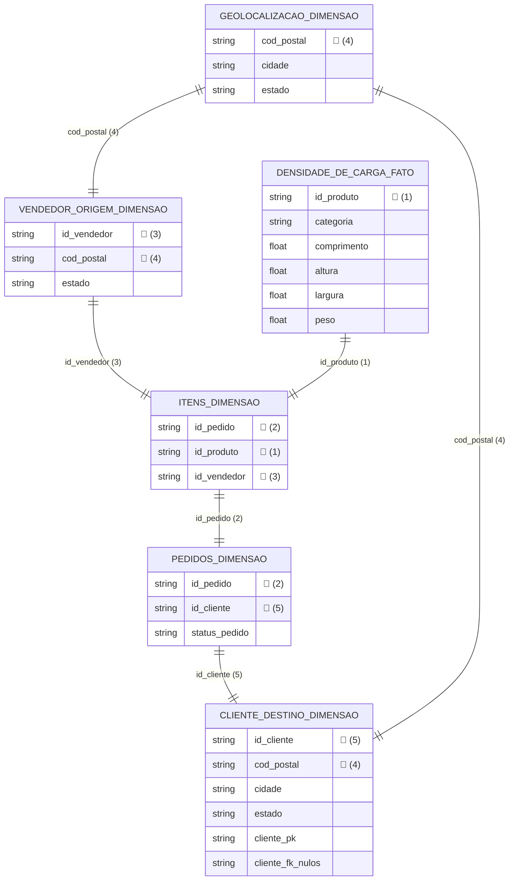
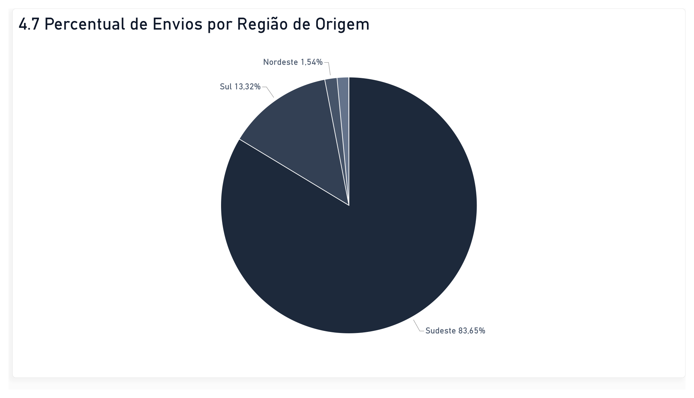
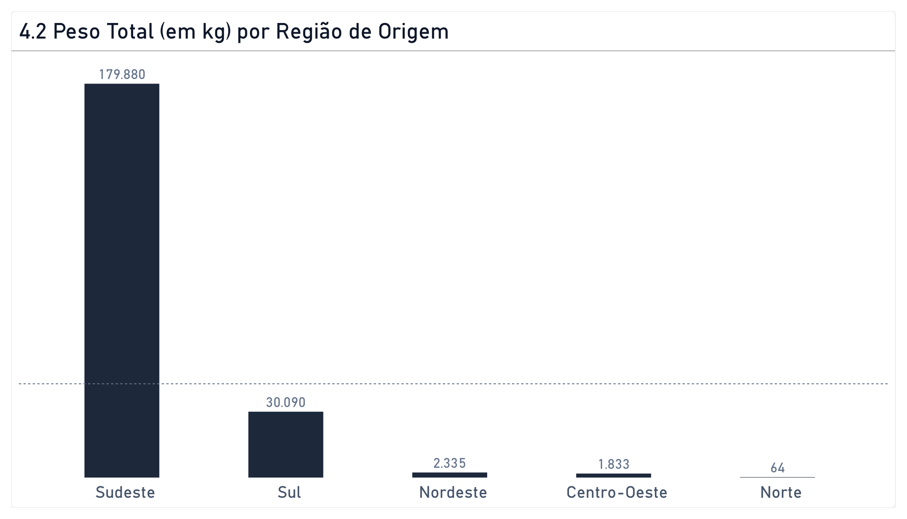
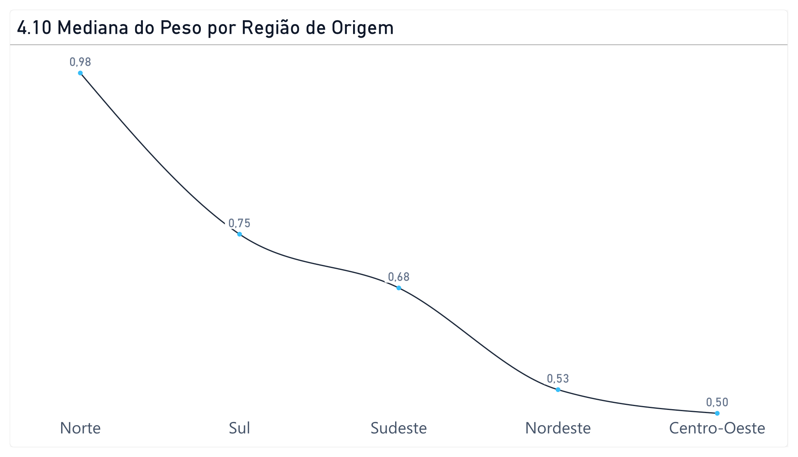
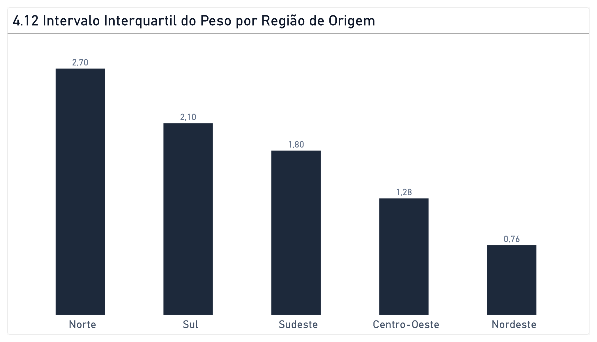
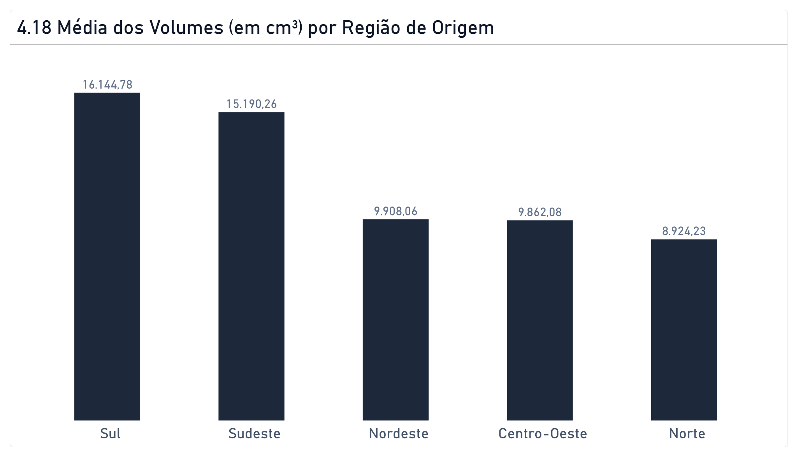
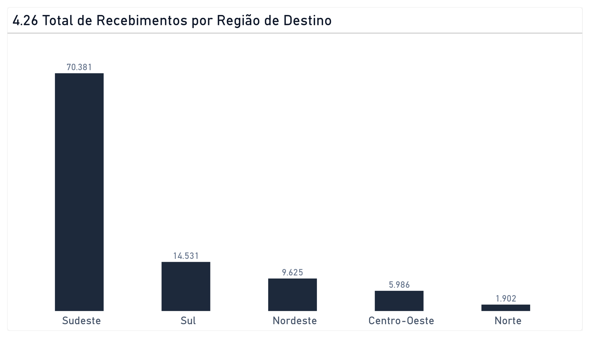
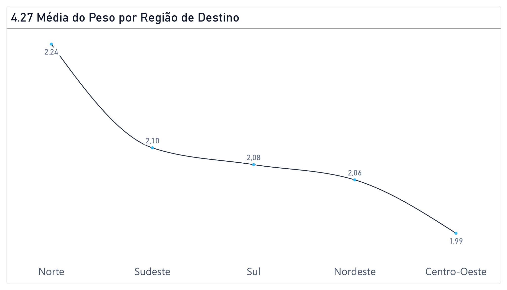
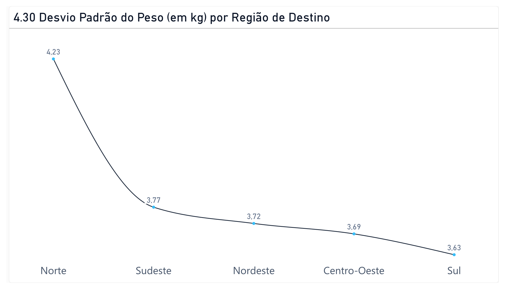

# 🚚 Análise Logística do E-Commerce 

💼 **Perfil Executivo:** [Baixe aqui a versão deste relatório em PDF para leitura offline](documentos/Relatorio_Executivo_Logistica.pdf).


## 📝 Visão Geral 

Este projeto consiste no desenvolvimento de uma Infraestrutura de Dados para analisar a Eficiência da Rede Logística e o desempenho das entregas no e-commerce brasileiro, servindo como o **Projeto de Conclusão (Capstone Project) do Certificado Profissional de Análise de Dados do Google**. A análise foi estruturada seguindo rigorosamente as fases de governança, processamento e geração de insights recomendadas pelo framework do Google.


<!-- Selos do Certificado Google e Coursera -->
 &nbsp;&nbsp; 


## Tecnologias Utilizadas


<table>
  <tr>
    <td align="center" width="90"></td>
    <td align="center" width="90"></td>
    <td align="center" width="90"></td>
    <td align="center" width="90"></td>
    <td align="center" width="90"></td>
    <td align="center" width="90"></td>
    <td align="center" width="90"></td>
  </tr>
</table>


## Estrutura Formal do Projeto

```text
├── LICENÇA
├── README.md                                 <- Guia e documentação executiva do portfólio.
├── consultas/                                <- Diretório dos scripts SQL executados no BigQuery.
│   ├── 01-preparacao-e-homologacao.sql       <- Validação de integridade, governança e viabilidade dos dados.
│   ├── 02-pipeline-engenharia-limpeza.sql    <- Processamento das CTEs e consolidação das 102.425 linhas.
│   └── 03-analise-estatistica-descritiva.sql <- Queries analíticas de cubagem, peso e volumetria de rotas.
├── relatórios/                               <- Entregáveis de visualização e tomada de decisão.
│   ├── dashboard-malha-logistica.pbix        <- Painel dinâmico e interativo desenvolvido no Power BI.
│   └── relatorio-insights-executivos.pdf     <- Relatório executivo formal com conclusões e planos de ação.
└── fonte/dados brutos                        <- Fontes originais do projeto. Arquivos (.csv), Olist.
    
```


## 🎯 Objetivo Geral

Diferentemente da maioria das análises públicas de e-commerce, que focam estritamente no tempo de entrega (lead time), este projeto adota uma abordagem de Engenharia de Redes Logísticas. O objetivo principal é analisar a capilaridade das rotas comerciais brasileiras sob a ótica da ocupação física de frota, avaliando o comportamento da densidade de carga (peso e cubagem) despachada entre os polos de origem e de destino. A análise estatística visa a identificar gargalos operacionais e assimetrias regionais no escoamento de mercadorias no e-commerce.

## 📌 Objetivos Específicos

O projeto gira em torno dos seguintes objetivos específicos:

**1. Verificação da assimetria geográfica no despacho de mercadorias:** identificar quais estados despacham cargas estatisticamente mais volumosas ou pesadas. Isso demonstrará quais regiões são polos de cargas robustas e quais enviam pacotes pequenos, auxiliando no dimensionamento da frota necessária para o atendimento desses locais.

**2. Construção da Matriz de Densidade de Carga:** mapear para quais estados de destino estão indo as mercadorias mais volumosas, leves ou pesadas, justificando o tipo de veículo necessário (pequeno ou grande porte) e a viabilidade de modais de transporte alternativos.

**3. Mapeamento do fluxo de escoamento:** quantificar o percentual dos pedidos que saem das regiões Sul e Sudeste e cruzam o país para abastecer o Norte e Nordeste. Essa métrica serve para justificar estrategicamente a necessidade de criação de novos Centros de Distribuição (CDs) para descentralizar os estoques.

**4. Demonstração do peso por Rota Comercial:** analisar estatisticamente se estados mais distantes (Norte/Nordeste) consomem produtos significativamente mais leves (como eletrônicos e cosméticos) para mitigar o impacto dos custos logísticos de longa distância, enquanto o Sul/Sudeste absorve produtos mais pesados (como móveis e eletrodomésticos).

## 🛠 Definição de Escopo e Arquitetura de Dados

Para garantir a eficiência computacional e o alinhamento com o objetivo de Engenharia de Redes Logísticas (focado em peso, cubagem e rotas), foi realizado um processo rigoroso de Recorte de Escopo no ecossistema original da Olist:


**Foco em Volumetria e Fluxo:** O projeto consolidou uma matriz relacional baseada estritamente nas entidades essenciais de tráfego físico, que basicamente se resumem a origem e destino da carga, peso ou volume, categoria de produtos transportados e geolocalização. 

**Abstração de Entidades Operacionais:** Visando manter a consistência analítica voltada à capacidade de carga, tabelas puramente transacionais como tempo de entrega, valor de frete e afins foram deliberadamente desconsideradas do pipeline principal, reduzindo o ruído estatístico na análise e garantindo que somente os dados de interesse fossem considerados. Essa atitude promove economia de recursos e redução do esforço computacional no processamento dos dados.


## 📊 Dataset Escolhido

O conjunto de dados utilizado foi obtido através da plataforma Kaggle e se refere a um conjunto de dados bastante conhecido por retratar dados reais e anonimizados do e-commerce no Brasil: o Olist.


## 📐 Arquitetura da Base de Dados

Antes do processo de consolidação, o ecossistema de dados foi desenhado com base em 6 entidades estruturais (tabelas), mapeadas a partir dos arquivos brutos (.csv):

<details>
<summary>📂 Clique para acessar os Dados Brutos Originais (Kaggle)</summary>

Os arquivos originais utilizados neste projeto pertencem ao ecossistema de e-commerce da Olist e podem ser baixados individualmente nos links abaixo:

* 📄 **Produtos (Densidade de Carga):** [olist_products_dataset.csv](./dados_brutos/olist_products_dataset.csv)
* 📄 **Itens dos Pedidos:** [olist_order_items_dataset.csv](./dados_brutos/olist_order_items_dataset.csv)
* 📄 **Clientes:** [olist_customers_dataset.csv](./dados_brutos/olist_customers_dataset.csv)
* 📄 **Geolocalização:** [olist_geolocation_dataset.csv](./dados_brutos/olist_geolocation_dataset.csv)
* 📄 **Pedidos:** [olist_orders_dataset.csv](./dados_brutos/olist_orders_dataset.csv)
* 📄 **Vendedores:** [olist_sellers_dataset.csv](./dados_brutos/olist_sellers_dataset.csv)

*(Nota: Caso prefira baixar o pacote completo consolidado, você pode acessar diretamente a página principal do dataset no **[Kaggle](https://kaggle.com)**).*

</details>


## 💻 Pipeline de Engenharia e Tratamento de Dados

O processo de transformação de dados foi executado via Google BigQuery utilizando SQL (GoogleSQL) estruturado em CTEs (*Common Table Expressions*). 

A arquitetura do pipeline foi desenhada criando **CTEs de limpeza exclusivas** (uma para cada tabela de origem). Esse método permitiu centralizar as regras de limpeza, tratamento de expressões regulares, imputação e formatação de maneira isolada por entidade. A consolidação final foi realizada utilizando cruzamentos relacionais do tipo **`LEFT JOIN`**, garantindo a integridade da base principal e evitando a perda acidental de registros devido a potenciais inconsistências ou dados ausentes nas tabelas acessórias.


## 📊 Metodologia de Análise

Para mapear a volumetria das rotas comerciais e identificar as assimetrias regionais, o projeto utilizou as seguintes métricas descritivas fundamentais: Análise Exploratória de Dados e Estatística Descritiva.

## 💾 Estrutura do Dataset Consolidado

Após a execução do pipeline de ETL, a tabela final limpa foi consolidada no Google BigQuery com 102.425 linhas.


## ⚙️ Fases da Análise de Dados

</p>
<!-- FASE 1: PREPARAR -->
<details>
<summary><h2>📁 Fase 1: Preparar (Modelagem e Viabilidade)</h2></summary>
<p>

Aqui ocorre a validação dos dados brutos para saber se são datasets reais ou artificiais.


## 🛑 1.1 Homologação de Autenticidade e Filtro de Viabilidade

Antes de iniciar qualquer esforço computacional de engenharia ou pipeline de ETL, foi estabelecida uma **"Etapa Zero" de Governança**. O objetivo foi mitigar o risco de processar dados sintéticos ou simulados (comportamento comum em bases públicas), garantindo que apenas entidades com variabilidade empírica real fossem integradas ao projeto.

Para isso, todas as tabelas originais que lidam com dados numéricos (do tipo INTEGER ou FLOAT) foram submetidas a um teste preliminar de **Estatística Descritiva Agrupada**, avaliando o comportamento das médias, desvios padrões e amplitudes (Mín/Máx). Tabelas que não lidam com dados tipo INTEGER ou FLOAT, não precisam ser submetidas ao teste para validar a heterocedasticidade.

**Critério de Aceitação:** As entidades que apresentaram comportamento **Heterocedástico** (variabilidade real, dispersão orgânica e desvios padrões consistentes) foram homologadas para o pipeline.

**Critério de Exclusão:** Tabelas que demonstraram variabilidade nula ou repetição matemática perfeita foram deliberadamente desconsideradas desta fase do projeto, otimizando o esforço de engenharia e blindando os futuros insights contra dados sem valor analítico.

> [IMPORTANTE]
> 💡 **Nota de Experiência Pessoal:** Esse é um procedimento padrão que tenho adotado antes de iniciar a manipulação de qualquer volume de dados, pois garante que eu esteja trabalhando com um conjunto de dados real, e não com um dataset manipulado por I.A. e que não apresenta variabilidade. Essa abordagem nasceu da necessidade prática após experiências anteriores com bases públicas sintéticas que inviabilizaram a geração de insights.


</p>

## 1.2 Teste de Heterocedasticidade

Clique abaixo para visualizar as queries de validação de variância da base original:

<details style="margin-left: 20px; margin-bottom: 10px;">
<summary><b>📦 Tabela: Produtos (olist_products)</b></summary>


A tabela referente ao arquivo "olist_products" (aqui no projeto denominada como "densidade_carga") é a única que lida de maneira majoritária com dados do tipo INTEGER/FLOAT, estando, portanto, apta a submeter-se ao teste que valida sua heterocedasticidade.


    
```sql

SELECT product_category_name,

  AVG (product_weight_g) AS media_peso,
  AVG (product_length_cm) AS media_comprimento, 
  AVG (product_height_cm) AS media_altura,
  AVG (product_width_cm) AS media_largura,

  STDDEV(product_weight_g) AS desvio_peso,
  STDDEV(product_length_cm) AS desvio_comprimento,
  STDDEV(product_height_cm) AS desvio_altura,
  STDDEV(product_width_cm) AS desvio_largura,

  MIN (product_weight_g) AS min_peso,
  MIN (product_length_cm) AS min_comp,
  MIN (product_height_cm) AS min_altura, 
  MIN (product_width_cm) AS min_largura,

  MAX (product_weight_g) AS max_peso,
  MAX (product_length_cm) AS max_comp,
  MAX (product_height_cm) AS max_altura, 
  MAX (product_width_cm) AS max_largura

 FROM `skilled-sunrise-486800-j9.analise_logistica.densidade_carga` 

GROUP BY product_category_name
ORDER BY media_peso DESC
 LIMIT 100;

```
Conclusão: A aplicação da estatística descritiva agrupada por categoria provou empiricamente que o dataset possui natureza REAL. A dispersão observada através dos desvios padrões e a amplitude entre os valores mínimos e máximos refletem o comportamento esperado de uma operação logística real.<br><br>
O conjunto de dados apresenta um comportamento HETEROCEDÁSTICO (variâncias significativamente diferentes entre as categorias de produtos), o que é característico do e-commerce brasileiro.<br><br>
Fica validada a riqueza estatística da base para darmos início ao processo de engenharia e limpeza de dados.


  </details>
  </details>

</details>

 
<!-- FASE 2: PROCESSAR -->
<details>
<summary><h2>🧹 Fase 2: Processar (Engenharia de Dados e Limpeza)</h2></summary>
<p>
Aqui ocorre a transformação pesada dos dados brutos no Google BigQuery utilizando 6 CTEs modulares, uma para cada tabela utilizada.

### 📑 Scripts SQL de Limpeza 
Os scripts com as transformações de cada base de dados podem ser consultados individualmente nos links abaixo:

| Pipeline de Limpeza (Tabela) | Link para o Script SQL |
| :--- | :--- |
| 📦 **Densidade de Carga** | [Visualizar SQL](./consultas/Código%20Tabela%20Densidade%20de%20Carga%20Limpo%20.sql) |
| 🛒 **Itens dos Pedidos** | [Visualizar SQL](./consultas/Código%20Tabela%20Itens%20Limpa.sql) |
| 👥 **Clientes** | [Visualizar SQL](consultas/Código%20Tabela%20Cliente%20Destino%20Limpa.sql) |
| 📍 **Geolocalização** | [Visualizar SQL](./consultas/Código%20Tabela%20Geolocalização%20Limpa.sql) |
| 📝 **Pedidos** | [Visualizar SQL](./consultas/Código%20Tabela%20Pedidos%20Limpo.sql) |
| 🏬 **Vendedores** | [Visualizar SQL](./consultas/Código%20Tabela%20Vendedor%20Origem%20Limpo.sql) |


Após efetuada a limpeza de todas as tabelas, o desafio foi uni-las usando cláusulas LEFT JOIN para fazer a integração das chaves primárias com as chaves estrangeiras. Foi esboçado também uma DIAGRAMA ENTIDADE-RELACIONAMENTO para ajudar a entender de que forma as tabelas se relacionam entre si e qual delas era a Tabela Fato e quais eram as Tabelas Dimensão.

| Pipeline de Integração e Modelagem (Tabela) | Link para o Script SQL |
| :--- | :--- |
| 🗄️ **Base Analítica Consolidada** | [Visualizar SQL](./consultas/Join%20para%20Análise%20Estatística%20-%20Dataset%20Logística.sql) |

A união dessas tabelas por meio de uma estrutura de CTE com qualificação de escopo permitiram concluir a fase de **Processar** da metodologia Google. O resultado foi a materialização de uma tabela física permanente (`base_analitica`), garantindo a integridade dos registros e otimizando severamente o custo e a performance de processamento para os próximos passos.

<details>
<summary>💡 Clique aqui para entender os desafios técnicos e soluções na consolidação dos JOINs</summary>


A query acima foi construída com uma engenharia e arquitetura diferentes. Tive muita dificuldade para conectar essas tabelas, pois toda vez que tentava executar um LEFT JOIN, o código quebrava. Aparentemente havia algum conflito entre o nome das tabelas e o comando SELECT. O SELECT serve para exibir COLUNAS de uma determinada tabela, portanto, mesmo colocando o asterisco isolado  após o comando, o código não rodava. Tentei de todas as formas possíveis fazer com que as tabelas e suas respectivas colunas fossem lidas e processadas pelo BigQuery, porém o sistema exibia um erro de sintaxe. Eu descobri, mediante pesquisa, que havia uma maneira de representar todas as colunas de todas as tabelas de uma única vez, entretanto sem utilizar o comando padrão SELECT + asterisco. 

Para resolver este impasse, usei aliases monossilábicos para representar as tabelas. Depois que o BigQuery fez a leitura dos aliases e os registrou na memória, eu os coloquei após o comando SELECT acompanhados de um ponto e um asterisco. Esse mecanismo é chamado de QUALIFICAÇÃO DE ESCOPO. A combinação do alias + ponto + asterisco funciona como um atalho. Quando o BigQuery lê dc.* ou ids.*, o mecanismo por trás faz o seguinte: lê as tabelas e depois lê todas as colunas de cada uma das tabelas e as replica no comando SELECT. Em outras palavras, ele "desembrulha" a tabela e substitui aquele asterisco pela lista escrita de TODAS as colunas, separadas por vírgula. Foi assim que consegui resolver o problema e fazer com que todas as colunas de todas as tabelas citadas fossem lidas pelo SELECT.

Se eu não tivesse descoberto esse atalho e as tabelas limpas tivessem 20 colunas cada uma, por exemplo, eu seria obrigado a digitar manualmente, para cada uma das tabelas, os 20 nomes de colunas no topo do código. Ao usar dc.* ou ids.*, eu mantenho a regra do SELECT (trazer colunas), mas uso o poder do banco de dados para listar todas elas de maneira mais prática, sem a necessidade de especificá-las uma a uma. 

Depois que solucionei o problema anterior, deparei-me com outro: a dificuldade de conectar as chaves primárias (PK) com as chaves estrangeiras (FK), bem como definir quem era TABELA DIMENSÃO e quem era TABELA FATO. Montei de maneira informal e improvisada um rascunho para o DIAGRAMA ENTIDADE-RELACIONAMENTO na tentativa de conseguir determinar de que forma uma tabela se comunicava com a outra. Desenhei retângulos para representar as tabelas; dentro dos retângulos listei somente as colunas que eu iria usar na minha análise e desprezei as colunas que considerei desnecessárias. 

A tabela de DENSIDADE DE CARGA foi a que melhor se encaixou no conceito da tabela fato, pois ela representa, indubitavelmente, o coração da minha análise. É justamente dessa tabela que vem as informações sobre os pesos e volumes das cargas (bjetos de análise do meu projeto) e sobre as quais eu não poderia perder uma única linha. Deste modo, ela foi escolhida como HUB e posicionei ela à esquerda do comando LEFT JOIN. Isso garante que o sistema faça a leitura considerando todas as suas linhas, gerando conexões perfeitas (quando suas chaves estrangeiras se correspondem com as chaves primárias de outra tabela dimensão) ou gerando linhas com valores nulos quando não há correspondênca entre as chaves. 

Outra candidata à Tabela Fato seria a tabela ÍTENS, pois ela marcava dados financeiros tais como preço dos produtos e preço do frete. Entretanto, minha análise não foca no clichê de análise de custo de frete. O preço do produto também é irrelevante na análise, visto que no modelo logístico tradicional de e-commerce, o preço do produto não dita a inteligência de malha de distribuição. Uma geladeira de R$ 3.000 e uma televisão de R$ 3.000 ocupam espaços totalmente diferentes e exigem frotas/veículos de entrega completamente distintos. Deste modo, optei por desconsiderar essas duas colunas reduzindo os dados a uma tabela formada essencialmente por IDs (ID do pedido, ID do produto e ID do vendedor). Nesse caso, a tabela de itens acabou se tornando uma mera Tabela Dimensão que comporta chaves primárias relevantes para fazer conexões. 

A modelagem de dados pedominante nesses JOINS é o Modelo Floco de Neve (Snowflake Schema). Existe uma tabela fato que se liga à tabela dimensão, mas também observamos tabelas dimensões se ligando a outras tabelas dimensão. A geolocalização se ligando ao cliente é um exemplo. Quando uma dimensão se conecta em outra dimensão antes de chegar na fato, as pontas da sua "estrela" se ramificam. É por isso que esse modelo se chama Floco de Neve.

</details>

<details>
<summary>📂 Visualizar Diagrama Entidade-Relacionamento </summary>




</details>

</details>

<!-- FASE 3: ANALISAR -->
<details>
<summary><h2>📊 Fase 3: Analisar (Estatística Descritiva)</h2></summary>
<p>


## 🛠️ Análise Exploratória e Engenharia de Dados

Nesta etapa do projeto, o foco está na preparação do ecossistema de dados para garantir a consistência das análises estatísticas e modelagens futuras. O objetivo principal foi transformar dados brutos em ativos de informação alinhados com as regras de negócio do setor logístico brasileiro. 

O processo foi dividido em duas frentes iniciais: o mapeamento estrutural dos dados disponíveis e a aplicação de transformações matemáticas para padronização de medidas, permitindo uma segmentação precisa do perfil das cargas movimentadas.


---

<details>
<summary><h3>📁 ETAPA 0: Inventário, Classificação e Engenharia de Variáveis</h3></summary>


Antes de iniciar o tratamento estatístico e a aplicação de modelos, realizou-se um inventário detalhado das variáveis disponíveis e sua respectiva categorização. Essa etapa preparatória é fundamental para ambientar o leitor e demonstrar como a análise está estruturada. 

Ao mapear a natureza de cada dado (seja ele categórico ou numérico), estabelecemos a base para as técnicas estatísticas que serão aplicadas a seguir, garantindo que cada métrica seja tratada com a abordagem matemática correta dentro do contexto logístico.


| Tipo de Variável | Variáveis Identificadas |
| :--- | :--- |
| **Qualitativas (Categóricas)** | `categoria_produto`, `status_pedido`, `estado_origem`, `estado_destino`, `cidade_destino` |
| **Quantitativas (Numéricas)** | `peso_em_kg`, `peso_em_ton`, `volume_em_m3`, `fator_de_cubagem` |

</details>

---

<details>
<summary><h3>📁 ETAPA 1: Transformação de Dados e Padronização Logística</h3></summary>


Esta etapa engloba a normalização de unidades de medida e a modelagem de métricas críticas para a operação logística.


*   **Padronização de Massa:** Conversão de gramas para quilogramas (kg) e toneladas (ton) para viabilizar análises macroeconômicas de fluxo interestadual (UF).
*   **Cubagem e Ocupação:** Cálculo do volume em metros cúbicos (m³) e do Fator de Cubagem (razão peso/volume), métrica padronizada pela ANTT (Agência Nacional de Transportes Terrestres).

> 📝 **Nota Técnica (Fator de Cubagem):** 
> Definido como a *Densidade Real* da carga, utiliza-se a linha de corte de **300 kg/m³** para a seguinte classificação operacional:
>
> 1. **< 300 kg/m³ (Carga Leve/Volumosa):** Alta ocupação de espaço físico antes de atingir o limite de peso do veículo (Ex: travesseiros, eletrônicos).
> 2. **≥ 300 kg/m³ (Carga Densa/Pesada):** Alta concentração de peso em baixo volume, atingindo o limite de carga por eixo antes da lotação visual do baú.

<details>
<summary><b>💻 Clique aqui para visualizar o código SQL de Padronização Logística</b></summary>

```sql
SELECT 
  categoria_ajust AS categoria_produto,
  status_pedido_ajust AS status_pedido,
  estado_origem_vend AS estado_origem,
  sigla_estado_ajust AS estado_destino,
  cidade_destino_ajust AS cidade_destino,

  -- Normalização de massa para escala industrial (kg e toneladas)
  (peso_em_gramas / 1000) AS peso_em_kg,
  (peso_em_gramas / 1000000) AS peso_em_ton,

  -- Conversão volumétrica de cm³ para m³
  (comprimento_em_cm * largura_em_cm * altura_em_cm) / 1000000 AS volume_em_m3,

  -- Razão de densidade (Peso/Volume) com tratamento robusto para divisão por zero
  ROUND(SAFE_DIVIDE
    ((peso_em_gramas / 1000), 
    ((comprimento_em_cm * altura_em_cm * largura_em_cm) / 1000000)), 2) AS fator_de_cubagem

FROM `skilled-sunrise-486800-j9.analise_logistica.base_analitica`;
```

</details>

</details>

---

<details>
<summary><h3>📁 ETAPA 2: Matriz de Cruzamento e Escopo Analítico</h3></summary>


Para otimizar o processamento e a governança dos dados, removeu-se atributos de baixa variância ou irrelevantes para o escopo estatístico (como chaves primárias/IDs e coordenadas geográficas brutas). 

O dataset otimizado fundamenta-se em **três Macroestruturas Analíticas Descritivas**, que guiam o tratamento estatístico nas etapas subsequentes:

* 🗺️ **1. Densidade e Distribuição Geográfica (Origem e Destino):** Mapeamento da concentração de massa física (peso) e capacidade espacial (volume) segregados de forma independente por UFs e Macrorregiões brasileiras.
* 📦 **2. Capacidade Operacional por Categoria de Produto:** Análise detalhada dos estimadores descritivos de tendência central, dispersão e assimetria do peso focado no núcleo pesado das categorias líderes de mercado.
* ⏱️ **3. Nível de Serviço (SLA) e Status do Pedido:** Proporção percentual e volumétrica de pedidos conforme o status de atendimento (atendidos, em trânsito e cancelados) cruzados geograficamente.

</details>

---

<details>
<summary><h3>📁 ETAPA 3: Materialização da Tabela de Suporte Estatístico</h3></summary>


Criação da camada física otimizada contendo exclusivamente os atributos selecionados para modelagem analítica e consumo em ferramentas de BI.

Para garantir a eficiência operacional das consultas e focar o escopo do projeto, selecionei as colunas estritamente relevantes para a análise e criei uma tabela exclusiva destinada à execução da estatística descritiva. Essa abordagem isola o ambiente de modelagem e otimiza o processamento dos dados.

<details>
<summary><b>💻 Clique aqui para visualizar o código SQL de criação da tabela</b></summary>

```sql
CREATE OR REPLACE TABLE `skilled-sunrise-486800-j9.analise_logistica.metricas_estatisticas` AS
SELECT 
  categoria_ajust AS categoria_produto,
  status_pedido_ajust AS status_pedido,
  estado_origem_vend AS estado_origem,
  sigla_estado_ajust AS estado_destino,
  cidade_destino_ajust AS cidade_destino,
  (peso_em_gramas / 1000) AS peso_em_kg,
  (peso_em_gramas / 1000000) AS peso_em_ton,
  (comprimento_em_cm * largura_em_cm * altura_em_cm) / 1000000 AS volume_em_m3,
  ROUND(SAFE_DIVIDE
    ((peso_em_gramas / 1000), 
    ((comprimento_em_cm * altura_em_cm * largura_em_cm) / 1000000)), 2) AS fator_de_cubagem
FROM `skilled-sunrise-486800-j9.analise_logistica.base_analitica`;
```

</details>

</details>

---

<details>
<summary><h3>📁 ETAPA 4: Estatística Descritiva e Cálculo de Estimadores</h3></summary>


Com a base analítica materializada e otimizada, inicia-se a fase de tratamento estatístico descritivo. Esta etapa visa extrair os principais estimadores de tendência central e de dispersão das variáveis numéricas, permitindo compreender o comportamento, a variabilidade e a distribuição dos dados logísticos.

| Pipeline de Estatística Descritiva (Tabela) | Link para o Script SQL |
| :--- | :--- |
| **Análise de Estimadores Logísticos** | [Visualizar SQL](./consultas/Consulta%20de%20Análise%20Estatística.sql) |


#### 🗺️ Macroestrutura de Densidade Geográfica: Análise de Origem (Estados e Regiões)


* 💡 Os indicadores apontam para uma centralização crítica da malha logística brasileira na Região Sudeste, que concentra a esmagadora maioria tanto da massa física total movimentada quanto do fluxo absoluto de transações operacionais (envios).

<details>
<summary><b>🛠️ Ver Queries SQL (4.1, 4.2, 4.6 e 4.7) e Tabelas de Resultados</b></summary>

##### 💻 4.1 Frequência absoluta do peso total por estado de origem
```sql
SELECT
ROUND(SUM(peso_em_kg), 2) AS peso_total_kg,
estado_origem
FROM `skilled-sunrise-486800-j9.analise_logistica.metricas_estatisticas`
GROUP BY estado_origem
ORDER BY peso_total_kg DESC;
```

##### 📋 Tabela Resultado 4.1
| peso_total_kg | estado_origem |
|---------------|---------------|
| 148941.66     | SP            |
| 22434.44      | MG            |
| 16185.94      | PR            |
| 9957.71       | SC            |
| 6398.37       | RJ            |
| 3946.13       | RS            |
| 2105.95       | ES            |
| 1145.78       | BA            |
| 956.22        | DF            |
| 520.98        | GO            |
| 507.08        | CE            |
| 325.61        | PE            |
| 236.36        | MT            |
| 205.3         | MA            |
| 119.51        | MS            |
| 57.1          | PB            |
| 56.04         | RN            |
| 45.49         | RO            |
| 23.67         | PI            |
| 15.17         | PA            |
| 14.44         | SE            |
| 1.9           | AC            |
| 1.05          | AM            |


##### 💻 4.2 Frequência absoluta do peso total por região usando a cláusula CASE WHEN
```sql
SELECT
    CASE 
        WHEN estado_origem IN ('SP', 'RJ', 'MG', 'ES') THEN 'Sudeste'
        WHEN estado_origem IN ('PR', 'SC', 'RS') THEN 'Sul'
        WHEN estado_origem IN ('BA', 'PE', 'CE', 'MA', 'PB', 'RN', 'AL', 'SE', 'PI') THEN 'Nordeste'
        WHEN estado_origem IN ('MT', 'MS', 'GO', 'DF') THEN 'Centro-Oeste'
        WHEN estado_origem IN ('AM', 'PA', 'RO', 'TO', 'AC', 'AP', 'RR') THEN 'Norte'
        ELSE 'Não Identificado'
    END AS regiao_origem,
    ROUND(SUM(peso_em_kg), 2) AS peso_total_kg
FROM `skilled-sunrise-486800-j9.analise_logistica.metricas_estatisticas`
GROUP BY regiao_origem
ORDER BY peso_total_kg DESC;
```

##### 📋 Tabela Resultado 4.2
| regiao_origem | peso_total_kg |
|---------------|---------------|
| Sudeste       | 179880.41     |
| Sul           | 30089.78      |
| Nordeste      | 2335.01       |
| Centro-Oeste  | 1833.07       |
| Norte         | 63.61         |


##### 💻 4.6 Frequência absoluta por região (Total de Despachos)
```sql
SELECT 
    CASE 
        WHEN estado_origem IN ('SP', 'RJ', 'MG', 'ES') THEN 'Sudeste'
        WHEN estado_origem IN ('PR', 'SC', 'RS') THEN 'Sul'
        WHEN estado_origem IN ('BA', 'PE', 'CE', 'MA', 'PB', 'RN', 'AL', 'SE', 'PI') THEN 'Nordeste'
        WHEN estado_origem IN ('MT', 'MS', 'GO', 'DF') THEN 'Centro-Oeste'
        WHEN estado_origem IN ('AM', 'PA', 'RO', 'TO', 'AC', 'AP', 'RR') THEN 'Norte'
        ELSE 'Não Identificado'
    END AS regiao_origem,
    COUNT(*) AS valor_absoluto_despachos
FROM `skilled-sunrise-486800-j9.analise_logistica.metricas_estatisticas`
GROUP BY regiao_origem
ORDER BY valor_absoluto_despachos DESC;
```

##### 📋 Tabela Resultado 4.6
| regiao_origem | valor_absoluto_despachos |
|---------------|--------------------------|
| Sudeste       | 85681                    |
| Sul           | 13640                    |
| Nordeste      | 1580                     |
| Centro-Oeste  | 1498                     |
| Norte         | 26                       |


##### 💻 4.7 Frequência relativa de cargas despachadas por região (Percentual)
```sql
SELECT
    CASE 
        WHEN estado_origem IN ('SP', 'RJ', 'MG', 'ES') THEN 'Sudeste'
        WHEN estado_origem IN ('PR', 'SC', 'RS') THEN 'Sul'
        WHEN estado_origem IN ('BA', 'PE', 'CE', 'MA', 'PB', 'RN', 'AL', 'SE', 'PI') THEN 'Nordeste'
        WHEN estado_origem IN ('MT', 'MS', 'GO', 'DF') THEN 'Centro-Oeste'
        WHEN estado_origem IN ('AM', 'PA', 'RO', 'TO', 'AC', 'AP', 'RR') THEN 'Norte'
        ELSE 'Não Identificado'
    END AS regiao_origem,
    COUNT(*) AS total_despachos,
    ROUND((COUNT(*) / (SELECT COUNT(*) FROM `skilled-sunrise-486800-j9.analise_logistica.metricas_estatisticas`)) * 100, 4) AS percentual_total
FROM `skilled-sunrise-486800-j9.analise_logistica.metricas_estatisticas`
GROUP BY regiao_origem
ORDER BY percentual_total DESC;
```

##### 📋 Tabela Resultado 4.7
| regiao_origem | total_despachos | percentual_total |
|---------------|-----------------|------------------|
| Sudeste       | 85681           | 83.6524          |
| Sul           | 13640           | 13.3171          |
| Nordeste      | 1580            | 1.5426           |
| Centro-Oeste  | 1498            | 1.4625           |
| Norte         | 26              | 0.0254           |


</details>


---

#### 📐 Investigação de Tendência Central: Média vs. Mediana e o Impacto de Outliers


* 💡 O confronto entre as médias e as medianas revelou uma **forte assimetria à direita (positiva)** na distribuição de dados da malha logística. A média aritmética mostrou-se altamente vulnerável a *outliers* (valores extremos), insuflando os indicadores acima de 2 kg. A mediana provou ser uma métrica infinitamente mais robusta, desmascarando essa distorção e confirmando que o peso típico das mercadorias em todas as regiões brasileiras é inferior a 1 kg (característico de operações fracionadas leves/e-commerce).

<details>
<summary><b>🛠️ Ver Queries SQL (4.8, 4.9 e 4.10), Justificativas Estatísticas e Resultados</b></summary>

##### 💻 4.8 Calculando a média de peso por Região

> * Os resultados se inverteram por conta do volume de operações realizadas em cada região, destacando a Região Norte com a maior média de peso por despacho, seguida por Sul e Sudeste. Esse comportamento comprova que a média é altamente impactada por outliers, gerando distorções (assimetrias) e demonstrando que ela não é uma métrica robusta para avaliar o peso típico das cargas neste cenário. A próxima etapa consistirá no cálculo e análise das medianas para avaliar o grau de assimetria da distribuição.

```sql
SELECT
    CASE 
        WHEN estado_origem IN ('SP', 'RJ', 'MG', 'ES') THEN 'Sudeste'
        WHEN estado_origem IN ('PR', 'SC', 'RS') THEN 'Sul'
        WHEN estado_origem IN ('BA', 'PE', 'CE', 'MA', 'PB', 'RN', 'AL', 'SE', 'PI') THEN 'Nordeste'
        WHEN estado_origem IN ('MT', 'MS', 'GO', 'DF') THEN 'Centro-Oeste'
        WHEN estado_origem IN ('AM', 'PA', 'RO', 'TO', 'AC', 'AP', 'RR') THEN 'Norte'
        ELSE 'Não Identificado'
    END AS regiao_origem,
    ROUND(AVG(peso_em_kg), 2) AS media_peso
FROM `skilled-sunrise-486800-j9.analise_logistica.metricas_estatisticas`
GROUP BY regiao_origem
ORDER BY media_peso DESC;
```

##### 📋 Tabela Resultado 4.8
| regiao_origem | media_peso |
|---------------|------------|
| Norte         | 2.45       |
| Sul           | 2.21       |
| Sudeste       | 2.1        |
| Nordeste      | 1.48       |
| Centro-Oeste  | 1.22       |


##### 💻 4.9 Calculando a mediana do peso por estado

> * Enquanto grandes polos (como SP) pulverizam sua operação em milhares de pacotes fracionados de e-commerce extremamente leves, a operação em estados com menor volume de despacho acaba registrando cargas com maior densidade física individual (volumes fracionados mais robustos), o que eleva a sua posição no ranking de medianas.

```sql
SELECT DISTINCT
  estado_origem, 
  (PERCENTILE_CONT(peso_em_kg, 0.5) OVER(PARTITION BY estado_origem)) AS mediana_peso
FROM `skilled-sunrise-486800-j9.analise_logistica.metricas_estatisticas`
ORDER BY mediana_peso DESC;
```

> ⚙️ **Nota de Engenharia:** O uso da função de percentil trouxe resultados mais consistentes, isolando o efeito dos outliers e permitindo entender o perfil real de carga por estado. 


##### 📋 Tabela Resultado 4.9
| estado_origem | mediana_peso |
|---------------|--------------|
| ES            | 8.875        |
| CE            | 3.35         |
| RO            | 2.575        |
| PI            | 2.238        |
| MS            | 2.208        |
| AC            | 1.9          |
| SE            | 1.4          |
| MT            | 1.25         |
| MG            | 0.9          |
| PA            | 0.8          |
| SC            | 0.8          |
| PR            | 0.75         |
| BA            | 0.7          |
| PB            | 0.7          |
| RS            | 0.7          |
| SP            | 0.65         |
| RN            | 0.5685       |
| RJ            | 0.55         |
| PE            | 0.533        |
| GO            | 0.5          |
| MA            | 0.4          |
| DF            | 0.39         |
| AM            | 0.35         |


##### 💻 4.10 Calculando a mediana do peso por região

> *A mediana por região confirmou a forte assimetria positiva da base. A divergência entre as médias (superiores a 2 kg) e as medianas ocorre porque a média é severamente inflada por uma minoria de pacotes e caixas de maior densidade (outliers de carga). Ao fixar a linha de corte no percentil 50%, comprova-se estatisticamente que a operação física regional é predominantemente composta por volumes leves e fracionados.

```sql
SELECT DISTINCT
    CASE 
        WHEN estado_origem IN ('SP', 'RJ', 'MG', 'ES') THEN 'Sudeste'
        WHEN estado_origem IN ('PR', 'SC', 'RS') THEN 'Sul'
        WHEN estado_origem IN ('BA', 'PE', 'CE', 'MA', 'PB', 'RN', 'AL', 'SE', 'PI') THEN 'Nordeste'
        WHEN estado_origem IN ('MT', 'MS', 'GO', 'DF') THEN 'Centro-Oeste'
        WHEN estado_origem IN ('AM', 'PA', 'RO', 'TO', 'AC', 'AP', 'RR') THEN 'Norte'
        ELSE 'Não Identificado'
    END AS regiao_origem,
    PERCENTILE_CONT(peso_em_kg, 0.5) OVER(PARTITION BY
            CASE 
                WHEN estado_origem IN ('SP', 'RJ', 'MG', 'ES') THEN 'Sudeste'
                WHEN estado_origem IN ('PR', 'SC', 'RS') THEN 'Sul'
                WHEN estado_origem IN ('BA', 'PE', 'CE', 'MA', 'PB', 'RN', 'AL', 'SE', 'PI') THEN 'Nordeste'
                WHEN estado_origem IN ('MT', 'MS', 'GO', 'DF') THEN 'Centro-Oeste'
                WHEN estado_origem IN ('AM', 'PA', 'RO', 'TO', 'AC', 'AP', 'RR') THEN 'Norte'
                ELSE 'Não Identificado'
            END
    ) AS mediana_peso
FROM `skilled-sunrise-486800-j9.analise_logistica.metricas_estatisticas`
ORDER BY mediana_peso DESC;
```

##### 📋 Tabela Resultado 4.10
| regiao_origem | mediana_peso |
|---------------|--------------|
| Norte         | 0.975        |
| Sul           | 0.75         |
| Sudeste       | 0.675        |
| Nordeste      | 0.533        |
| Centro-Oeste  | 0.5          |


</details>


---

#### 📐 Métricas de Dispersão Robusta: Intervalo Interquartílico (IQR) e Variabilidade da Massa Central


* 💡  A análise do Intervalo Interquartílico (IQR) isolou os 50% das observações mais frequentes e revelou uma forte heterogeneidade na dispersão da malha. Polos com alto volume de e-commerce (como a região Nordeste e o estado de São Paulo) apresentam um IQR estreito, comprovando uma operação de alta padronização física focada em microvolumes. Em contrapartida, regiões periféricas de consumo (como o Norte e o estado do Espírito Santo) exibem um IQR amplo, o que traduz uma massa central de dados dispersa e com forte variabilidade física, demandando maior flexibilidade na consolidação e na cubagem dessas cargas.

<details>
<summary><b>🛠️ Ver Queries SQL (4.11 e 4.12), Justificativas Estatísticas e Resultados</b></summary>

##### 💻 4.11 Calculando o intervalo interquartílico por estado

> * O IQR mede a dispersão central ignorando a influência de extremos. Estados de grande volume absoluto (como SP) apresentam um IQR estreito (~1,45 kg), indicando alta padronização física das cargas. Em contrapartida, estados menores (como o ES) possuem um IQR amplo (~7,7 kg), comprovando que o miolo das cargas comuns varia drasticamente de tamanho. A variação de IQR entre os estados reforça a heterogeneidade da malha logística e serve de parâmetro para a futura identificação técnica de outliers.
> * O caso de PE registrou um IQR zerado (0.0) em 409 despachos, pois o Q1 e o Q3 possuem o mesmo valor (0.533 kg). Isso prova estatisticamente que pelo menos 50% de todas as cargas do estado possuem pesos idênticos, evidenciando uma operação totalmente padronizada em um único SKU ou tipo de produto com alta demanda mercadológica.


```sql
SELECT DISTINCT
    estado_origem,
    COUNT(*) OVER(PARTITION BY estado_origem) AS total_despachos,
    -- Aplicando o TRUNC no Q1:
    TRUNC(PERCENTILE_CONT(peso_em_kg, 0.25) OVER(PARTITION BY estado_origem), 3) AS q1_peso,
    -- Aplicando o TRUNC no Q3:
    TRUNC(PERCENTILE_CONT(peso_em_kg, 0.75) OVER(PARTITION BY estado_origem), 3) AS q3_peso,
    -- Aplicando o TRUNC no IQR:
    TRUNC(
        (PERCENTILE_CONT(peso_em_kg, 0.75) OVER(PARTITION BY estado_origem) - 
         PERCENTILE_CONT(peso_em_kg, 0.25) OVER(PARTITION BY estado_origem)), 3
    ) AS iqr_peso
FROM `skilled-sunrise-486800-j9.analise_logistica.metricas_estatisticas`
ORDER BY iqr_peso DESC;
```

> ⚙️ **Nota de Engenharia (Uso do TRUNC):** Devido ao tipo de dado `FLOAT` da coluna original, a subtração matemática `Q3 - Q1` gerava dízimas extensas decorrentes do erro de ponto flutuante do processador. O uso da função `TRUNC` em vez do `ROUND` elimina o excesso de dígitos preservando o valor bruto original em 3 casas decimais, garantindo a legibilidade da tabela sem forçar arredondamentos artificiais.


##### 📋 Tabela Resultado 4.11
| estado_origem | total_despachos | q1_peso | q3_peso | iqr_peso |
|---------------|-----------------|---------|---------|----------|
| ES            | 323             | 1.3     | 9.0     | 7.7      |
| CE            | 91              | 0.75    | 5.25    | 4.5      |
| MG            | 8128            | 0.282   | 3.407   | 3.124    |
| SC            | 3744            | 0.4     | 2.649   | 2.25     |
| BA            | 571             | 0.45    | 2.6     | 2.149    |
| PR            | 7877            | 0.22    | 2.0     | 1.78     |
| RO            | 14              | 1.179   | 2.939   | 1.76     |
| RS            | 2019            | 0.25    | 1.949   | 1.699    |
| SP            | 72818           | 0.299   | 1.75    | 1.449    |
| MS            | 49              | 1.699   | 3.041   | 1.341    |
| RN            | 54              | 0.299   | 1.5     | 1.199    |
| SE            | 9               | 1.0     | 2.149   | 1.149    |
| PI            | 12              | 1.099   | 2.237   | 1.138    |
| DF            | 828             | 0.174   | 1.199   | 1.024    |
| GO            | 481             | 0.282   | 1.276   | 0.993    |
| RJ            | 4412            | 0.303   | 1.199   | 0.895    |
| MT            | 140             | 0.5     | 1.25    | 0.75     |
| PB            | 37              | 0.45    | 1.199   | 0.75     |
| PA            | 8               | 0.287   | 0.962   | 0.674    |
| MA            | 397             | 0.349   | 0.699   | 0.349    |
| AM            | 3               | 0.341   | 0.359   | 0.018    |
| AC            | 1               | 1.899   | 1.899   | 0.0      |
| PE            | 409             | 0.533   | 0.533   | 0.0      |


##### 💻 4.12 Calculando o intervalo interquartílico por região

> * O IQR consolidado confirmou que a Região Norte lidera o ranking com a maior variabilidade na massa central de pesos (IQR: 2,057 kg), com o miolo das cargas oscilando entre 0,642 kg e 2,7 kg. Já o Nordeste apresentou a operação mais homogênea e padronizada (IQR: 0,312 kg), onde 50% dos volumes mais comuns estão concentrados entre 0,45 kg e 0,762 kg. O Sudeste e o Sul mantêm um perfil intermediário de dispersão (IQR de 1,5 kg e 1,8 kg, respectivamente). 

```sql
SELECT DISTINCT
    CASE 
        WHEN estado_origem IN ('SP', 'RJ', 'MG', 'ES') THEN 'Sudeste'
        WHEN estado_origem IN ('PR', 'SC', 'RS') THEN 'Sul'
        WHEN estado_origem IN ('BA', 'PE', 'CE', 'MA', 'PB', 'RN', 'AL', 'SE', 'PI') THEN 'Nordeste'
        WHEN estado_origem IN ('MT', 'MS', 'GO', 'DF') THEN 'Centro-Oeste'
        WHEN estado_origem IN ('AM', 'PA', 'RO', 'TO', 'AC', 'AP', 'RR') THEN 'Norte'
        ELSE 'Não Identificado'
    END AS regiao_origem,
    TRUNC(PERCENTILE_CONT(peso_em_kg, 0.25) OVER(
        PARTITION BY 
            CASE 
                WHEN estado_origem IN ('SP', 'RJ', 'MG', 'ES') THEN 'Sudeste'
                WHEN estado_origem IN ('PR', 'SC', 'RS') THEN 'Sul'
                WHEN estado_origem IN ('BA', 'PE', 'CE', 'MA', 'PB', 'RN', 'AL', 'SE', 'PI') THEN 'Nordeste'
                WHEN estado_origem IN ('MT', 'MS', 'GO', 'DF') THEN 'Centro-Oeste'
                WHEN estado_origem IN ('AM', 'PA', 'RO', 'TO', 'AC', 'AP', 'RR') THEN 'Norte'
                ELSE 'Não Identificado'
            END
    ), 3) AS q1_peso,
    TRUNC(PERCENTILE_CONT(peso_em_kg, 0.75) OVER(
        PARTITION BY 
            CASE 
                WHEN estado_origem IN ('SP', 'RJ', 'MG', 'ES') THEN 'Sudeste'
                WHEN estado_origem IN ('PR', 'SC', 'RS') THEN 'Sul'
                WHEN estado_origem IN ('BA', 'PE', 'CE', 'MA', 'PB', 'RN', 'AL', 'SE', 'PI') THEN 'Nordeste'
                WHEN estado_origem IN ('MT', 'MS', 'GO', 'DF') THEN 'Centro-Oeste'
                WHEN estado_origem IN ('AM', 'PA', 'RO', 'TO', 'AC', 'AP', 'RR') THEN 'Norte'
                ELSE 'Não Identificado'
            END
    ), 3) AS q3_peso,
    TRUNC(
        (PERCENTILE_CONT(peso_em_kg, 0.75) OVER(
            PARTITION BY 
                CASE 
                    WHEN estado_origem IN ('SP', 'RJ', 'MG', 'ES') THEN 'Sudeste'
                    WHEN estado_origem IN ('PR', 'SC', 'RS') THEN 'Sul'
                    WHEN estado_origem IN ('BA', 'PE', 'CE', 'MA', 'PB', 'RN', 'AL', 'SE', 'PI') THEN 'Nordeste'
                    WHEN estado_origem IN ('MT', 'MS', 'GO', 'DF') THEN 'Centro-Oeste'
                    WHEN estado_origem IN ('AM', 'PA', 'RO', 'TO', 'AC', 'AP', 'RR') THEN 'Norte'
                    ELSE 'Não Identificado'
                END
        ) - 
         PERCENTILE_CONT(peso_em_kg, 0.25) OVER(
            PARTITION BY 
                CASE 
                    WHEN estado_origem IN ('SP', 'RJ', 'MG', 'ES') THEN 'Sudeste'
                    WHEN estado_origem IN ('PR', 'SC', 'RS') THEN 'Sul'
                    WHEN estado_origem IN ('BA', 'PE', 'CE', 'MA', 'PB', 'RN', 'AL', 'SE', 'PI') THEN 'Nordeste'
                    WHEN estado_origem IN ('MT', 'MS', 'GO', 'DF') THEN 'Centro-Oeste'
                    WHEN estado_origem IN ('AM', 'PA', 'RO', 'TO', 'AC', 'AP', 'RR') THEN 'Norte'
                    ELSE 'Não Identificado'
                END
        )), 3
    ) AS iqr_peso
FROM `skilled-sunrise-486800-j9.analise_logistica.metricas_estatisticas`
ORDER BY iqr_peso DESC;
```

##### 📋 Tabela Resultado 4.12
| regiao_origem | q1_peso | q3_peso | iqr_peso |
|---------------|---------|---------|----------|
| Norte         | 0.642   | 2.7     | 2.057    |
| Sul           | 0.299   | 2.1     | 1.8      |
| Sudeste       | 0.299   | 1.8     | 1.5      |
| Centro-Oeste  | 0.224   | 1.276   | 1.052    |
| Nordeste      | 0.45    | 0.762   | 0.312    |


</details>


---

#### 📐 Quantificação de Anomalias e Amplitude Física: Contagem de Outliers e Parâmetros Extremos


* 💡 A volumetria de anomalias revelou um comportamento singular: embora São Paulo concentre o maior volume absoluto de desvios, Pernambuco lidera proporcionalmente com 24,44% de sua operação classificada como *outlier*. Como a malha pernambucana é extremamente padronizada (IQR zerado), qualquer oscilação mínima é interpretada matematicamente como uma anomalia local. Ceará (19,78%) e Santa Catarina (16,93%) consolidam-se logo em seguida, evidenciando centros de distribuição com forte presença de pesos atípicos.
* 💡 O teto absoluto de toda a malha nacional está em São Paulo, com um pacote máximo de 40,425 kg, enquanto estados como PR, RJ, MG e SC possuem tetos padronizados em exatamente 30,0 kg. A operação física lida puramente com caixas e envelopes individuais (perfil B2C/e-commerce), alimentada por mínimos que chegam a apenas 2 gramas.

<details>
<summary><b>🛠️ Ver Queries SQL (4.15 e 4.16), Justificativas Estatísticas e Resultados</b></summary>

##### 💻 4.15 Contagem e representatividade de outliers por estado


```sql
WITH limites_base AS (
    SELECT DISTINCT
        estado_origem,
        PERCENTILE_CONT(peso_em_kg, 0.25) OVER(PARTITION BY estado_origem) AS q1,
        PERCENTILE_CONT(peso_em_kg, 0.75) OVER(PARTITION BY estado_origem) AS q3
    FROM `skilled-sunrise-486800-j9.analise_logistica.metricas_estatisticas`
),
regras_corte AS (
    SELECT 
        estado_origem,
        (q3 + (1.5 * (q3 - q1))) AS limite_superior_moderado
    FROM limites_base
)
SELECT 
    b.estado_origem,
    COUNT(*) AS total_despachos,
    -- Conta apenas as linhas onde o peso furou o limite do respectivo estado:
    COUNT(CASE WHEN b.peso_em_kg > c.limite_superior_moderado THEN 1 END) AS qte_outliers_moderados,
    -- Calcula a participação percentual desses outliers na operação do estado:
    TRUNC((COUNT(CASE WHEN b.peso_em_kg > c.limite_superior_moderado THEN 1 END) / COUNT(*)) * 100, 2) AS percentual_outliers
FROM `skilled-sunrise-486800-j9.analise_logistica.metricas_estatisticas` b
JOIN regras_corte c ON b.estado_origem = c.estado_origem
GROUP BY b.estado_origem
ORDER BY qte_outliers_moderados DESC;
```

> ⚙️ **Justificativa de Engenharia e Necessidade do JOIN:** O BigQuery não permite comparar, na mesma linha, um dado individual (o peso de um único pacote) com um dado agregado (a régua de corte do estado) sem que eles estejam conectados. Para solucionar essa limitação, utilizou-se uma arquitetura em três etapas: a CTE `limites_base` calcula os percentis isolados; a CTE `regras_corte` aplica a fórmula de Tukey ($Q3 + 1.5 \times IQR$); e o `JOIN` atua como uma ponte física, colando a régua de corte estadual ao lado de cada uma das 102.425 linhas correspondentes da tabela bruta. Com essa associação feita, o comando condicional `COUNT(CASE WHEN)` varre a base linha por linha, calculando com precisão os volumes e os percentuais de violação por praça.

##### 📋 Tabela Resultado 4.15
| estado_origem | total_despachos | qte_outliers_moderados | percentual_outliers |
|---------------|-----------------|------------------------|---------------------|
| SP            | 72818           | 10016                  | 13.75               |
| PR            | 7877            | 939                    | 11.92               |
| MG            | 8128            | 754                    | 9.27                |
| SC            | 3744            | 634                    | 16.93               |
| RJ            | 4412            | 448                    | 10.15               |
| RS            | 2019            | 268                    | 13.27               |
| PE            | 409             | 100                    | 24.44               |
| GO            | 481             | 73                     | 15.17               |
| DF            | 828             | 58                     | 7.0                 |
| BA            | 571             | 49                     | 8.58                |
| MT            | 140             | 19                     | 13.57               |
| CE            | 91              | 18                     | 19.78               |
| PB            | 37              | 4                      | 10.81               |
| ES            | 323             | 3                      | 0.92                |
| SE            | 9               | 1                      | 11.11               |
| RN            | 54              | 1                      | 1.85                |
| PA            | 8               | 1                      | 12.5                |
| MA            | 397             | 1                      | 0.25                |
| PI            | 12              | 1                      | 8.33                |
| RO            | 14              | 1                      | 7.14                |
| MS            | 49              | 1                      | 2.04                |
| AM            | 3               | 0                      | 0.0                 |
| AC            | 1               | 0                      | 0.0                 |


##### 💻 4.16 Identificação de valores extremos (mínimo e máximo) por estado

> * A amplitude física escancara a heterogeneidade dos hubs logísticos e encerra o ciclo de análise física de peso das origens. Os valores máximos situados estritamente na faixa entre 14,9 kg e 40,425 kg confirmam que as distorções observadas nas médias anteriores eram provocadas por essas raras cargas densas esporádicas. 

```sql
SELECT 
    estado_origem,
    COUNT(*) AS total_despachos,
    MIN(peso_em_kg) AS peso_minimo_kg,
    MAX(peso_em_kg) AS peso_maximo_kg,
    -- Calcula a amplitude total da variação de peso do estado:
    TRUNC(MAX(peso_em_kg) - MIN(peso_em_kg), 3) AS amplitude_peso_kg
FROM `skilled-sunrise-486800-j9.analise_logistica.metricas_estatisticas`
GROUP BY estado_origem
ORDER BY amplitude_peso_kg DESC;
```

##### 📋 Tabela Resultado 4.16
| estado_origem | total_despachos | peso_minimo_kg | peso_maximo_kg | amplitude_peso_kg |
|---------------|-----------------|----------------|----------------|-------------------|
| SP            | 72818           | 0.002          | 40.425         | 40.422            |
| PR            | 7877            | 0.05           | 30.0           | 29.949            |
| RJ            | 4412            | 0.05           | 30.0           | 29.949            |
| MG            | 8128            | 0.05           | 30.0           | 29.949            |
| SC            | 3744            | 0.05           | 30.0           | 29.949            |
| ES            | 323             | 0.05           | 29.6           | 29.55             |
| DF            | 828             | 0.05           | 27.25          | 27.199            |
| RS            | 2019            | 0.05           | 22.525         | 22.474            |
| CE            | 91              | 0.15           | 19.15          | 19.0              |
| RO            | 14              | 0.64           | 17.3           | 16.66             |
| PE            | 409             | 0.05           | 15.5           | 15.449            |
| GO            | 481             | 0.083          | 14.9           | 14.817            |
| PB            | 37              | 0.28           | 14.25          | 13.97             |
| BA            | 571             | 0.05           | 13.7           | 13.649            |
| PA            | 8               | 0.25           | 10.825         | 10.574            |
| MT            | 140             | 0.15           | 10.4           | 10.25             |
| RN            | 54              | 0.115          | 8.5            | 8.384             |
| MS            | 49              | 1.0            | 7.15           | 6.15              |
| SE            | 9               | 0.1            | 4.917          | 4.817             |
| PI            | 12              | 0.6            | 4.6            | 3.999             |
| MA            | 397             | 0.3            | 1.4            | 1.099             |
| AM            | 3               | 0.333          | 0.37           | 0.036             |
| AC            | 1               | 1.9            | 1.9            | 0.0               |


</details>


---

> ⚙️ **Nota Operacional e de Engenharia de Dados: Cubagem e Escalabilidade da Arquitetura**
>
> **Premissas de Modelagem vs. Realidade Estatística da Malha:**
> 
> Na fase de design e modelagem, adotou-se uma diretriz tradicional de transporte rodoviário de cargas, projetando as estruturas e cálculos de cubagem na escala de TONELADAS e METROS CÚBICOS ($m^3$). O objetivo era analisar grandes massas de peso e volume regionais e comparar os fatores de cubagem para traçar estratégias de negócios. Entretanto, a fase de Análise Exploratória e Estatística Descritiva provou que a operação física real é predominantemente composta por microvolumes de e-commerce (varejo/B2C). Assim, as colunas estruturadas em $m^3$ e toneladas no banco de dados foram mantidas, mas as análises deste projeto em relação à cubagem focarão exclusivamente em **centímetros cúbicos**, em vez de metros cúbicos. Essa medida se faz necessária, pois a conversão em metros cúbicos exibe números decimais estremamente pequenos (como 0,000045 m³), o que compromete a legibilidade das informações e a comparação entre as medidas. Já no formato de centímentros cúbicos, temos números decimais com a parte inteira visível, facilitando a compreensão sobre a cubagem. A análise com o **fator de cubagem** também foi excluída do escopo deste projeto, por apresentar valores irrisórios para o tipo de operação. 


---

#### 📐 Análise de Volatilidade Amostral: Desvio Padrão e Coeficiente de Variação (CV)


* 💡 A análise do Coeficiente de Variação (CV) revelou realidades operacionais opostas. Identificou-se uma volatilidade extrema no Distrito Federal (CV de 214,10%) e Rio de Janeiro (CV de 205,95%), indicando que operam com fluxos altamente imprevisíveis que misturam envelopes ultra leves e caixas pesadas. No extremo oposto, hubs como Piauí (CV de 54,32%) e Espírito Santo (CV de 66,26%) consolidaram-se como malhas altamente estáveis e previsíveis, permitindo um planejamento de frotas muito mais padronizado e eficiente.

<details>
<summary><b>🛠️ Ver Query SQL (4.17), Justificativas Estatísticas e Resultados</b></summary>

##### 💻 4.17.1 Calculando o Desvio Padrão Amostral e o Coeficiente de Variação (CV)

> * > * O desvio padrão amostral e o CV isolaram o comportamento da dispersão em relação à média do peso das cargas agrupadas por regiões. Os resultados revelam uma altíssima volatilidade na operação logística em território nacional, com o CV superando a marca de 100% em todas as regiões — variando de 151,51% no Norte até impressionantes 199,77% no Nordeste. Estatisticamente, isso demonstra que o desvio padrão é muito superior à própria média dos pesos, indicando um mix de produtos extremamente heterogêneo (com convivência de pacotes muito leves e cargas muito pesadas na mesma região) ou uma forte presença de *outliers* na base de dados.
 

```sql
SELECT DISTINCT
    CASE 
        WHEN estado_origem IN ('SP', 'RJ', 'MG', 'ES') THEN 'Sudeste'
        WHEN estado_origem IN ('PR', 'SC', 'RS') THEN 'Sul'
        WHEN estado_origem IN ('BA', 'PE', 'CE', 'MA', 'PB', 'RN', 'AL', 'SE', 'PI') THEN 'Nordeste'
        WHEN estado_origem IN ('MT', 'MS', 'GO', 'DF') THEN 'Centro-Oeste'
        WHEN estado_origem IN ('AM', 'PA', 'RO', 'TO', 'AC', 'AP', 'RR') THEN 'Norte'
        ELSE 'Não Identificado'
    END AS regiao_origem,
    
    TRUNC(STDDEV_SAMP(peso_em_kg) OVER(
        PARTITION BY 
            CASE 
                WHEN estado_origem IN ('SP', 'RJ', 'MG', 'ES') THEN 'Sudeste'
                WHEN estado_origem IN ('PR', 'SC', 'RS') THEN 'Sul'
                WHEN estado_origem IN ('BA', 'PE', 'CE', 'MA', 'PB', 'RN', 'AL', 'SE', 'PI') THEN 'Nordeste'
                WHEN estado_origem IN ('MT', 'MS', 'GO', 'DF') THEN 'Centro-Oeste'
                WHEN estado_origem IN ('AM', 'PA', 'RO', 'TO', 'AC', 'AP', 'RR') THEN 'Norte'
                ELSE 'Não Identificado'
            END
    ), 3) AS desvio_padrao_peso_kg,

    TRUNC((STDDEV_SAMP(peso_em_kg) OVER(
        PARTITION BY 
            CASE 
                WHEN estado_origem IN ('SP', 'RJ', 'MG', 'ES') THEN 'Sudeste'
                WHEN estado_origem IN ('PR', 'SC', 'RS') THEN 'Sul'
                WHEN estado_origem IN ('BA', 'PE', 'CE', 'MA', 'PB', 'RN', 'AL', 'SE', 'PI') THEN 'Nordeste'
                WHEN estado_origem IN ('MT', 'MS', 'GO', 'DF') THEN 'Centro-Oeste'
                WHEN estado_origem IN ('AM', 'PA', 'RO', 'TO', 'AC', 'AP', 'RR') THEN 'Norte'
                ELSE 'Não Identificado'
            END
    ) / AVG(peso_em_kg) OVER(
        PARTITION BY 
            CASE 
                WHEN estado_origem IN ('SP', 'RJ', 'MG', 'ES') THEN 'Sudeste'
                WHEN estado_origem IN ('PR', 'SC', 'RS') THEN 'Sul'
                WHEN estado_origem IN ('BA', 'PE', 'CE', 'MA', 'PB', 'RN', 'AL', 'SE', 'PI') THEN 'Nordeste'
                WHEN estado_origem IN ('MT', 'MS', 'GO', 'DF') THEN 'Centro-Oeste'
                WHEN estado_origem IN ('AM', 'PA', 'RO', 'TO', 'AC', 'AP', 'RR') THEN 'Norte'
                ELSE 'Não Identificado'
            END
    )) * 100, 2) AS cv_peso_percentual

FROM `skilled-sunrise-486800-j9.analise_logistica.metricas_estatisticas`
ORDER BY cv_peso_percentual DESC;
```

##### 📋 Tabela Resultado 4.17.1
| regiao_origem | desvio_padrao_peso_kg | cv_peso_percentual |
|---------------|-----------------------|--------------------|
| Nordeste      | 2.952                 | 199.77          |
| Sudeste       | 3.762                 | 179.23           |
| Centro-Oeste  | 2.153                 | 175.99          |
| Sul           | 3.874                 | 175.63           |
| Norte         | 3.707                 | 151.51          |


</details>

---

> 🎯 **Nota de Transição Metodológica: Consolidação de Escopo Macro (Regiões)**
> 
> A fim de consolidar melhor as descobertas estatísticas e mitigar a poluição visual na futura etapa, as próximas análises deste ciclo focarão prioritariamente no comportamento das **macrorregiões brasileiras**. Essa abordagem garante uma visualização mais limpa, executiva e focada em grandes direcionamentos estratégicos de mercado.

---
---

#### 📐 Tendência Central do Espaço Ocupado: Média vs. Mediana de Volume


* 💡 Diferente do comportamento observado no peso, a análise da cubagem revelou que as regiões Sul e Sudeste lideram isoladas o ranking de ocupação de espaço físico por despacho. O confronto de métricas atesta uma **forte assimetria dimensional**, onde a média aritmética chega a superar o dobro da mediana em todas as regiões (como no Sul, com média de ~16.144 $cm^3$ vs. mediana de ~7.168 $cm^3$). Esse cenário comprova a presença constante de anomalias volumétricas (*outliers*) e evidencia o clássico desafio da cubagem: os grandes hubs nacionais movimentam mercadorias de alta ocupação espacial, mas de baixíssima densidade física (peso), tornando o espaço volumétrico — e não o peso — o principal gargalo operacional para o dimensionamento de veículos.

<details>
<summary><b>🛠️ Ver Query SQL (4.18), Justificativas Estatísticas e Resultados</b></summary>

##### 💻 4.18 Tendência central (média e mediana) do volume (em cm³) por região

> * Enquanto a malha de expedição do Norte atua no extremo oposto com foco em cargas predominantemente pequenas e densas (registrando a menor média volumétrica nacional de ~8.924 $cm^3$), os fluxos do Sul e Sudeste demandam frotas urbanas com alta capacidade cúbica (motos com baús estendidos, furgões e vans utilitárias), uma vez que o miolo da operação consome muito mais espaço físico por pacote individual.

```sql
SELECT DISTINCT
    CASE 
        WHEN estado_origem IN ('SP', 'RJ', 'MG', 'ES') THEN 'Sudeste'
        WHEN estado_origem IN ('PR', 'SC', 'RS') THEN 'Sul'
        WHEN estado_origem IN ('BA', 'PE', 'CE', 'MA', 'PB', 'RN', 'AL', 'SE', 'PI') THEN 'Nordeste'
        WHEN estado_origem IN ('MT', 'MS', 'GO', 'DF') THEN 'Centro-Oeste'
        WHEN estado_origem IN ('AM', 'PA', 'RO', 'TO', 'AC', 'AP', 'RR') THEN 'Norte'
        ELSE 'Não Identificado'
    END AS regiao_origem,
    
    -- Média convertida para cm³ e truncada em 3 casas decimais:
    TRUNC(AVG(volume_em_m3) OVER(
        PARTITION BY 
            CASE 
                WHEN estado_origem IN ('SP', 'RJ', 'MG', 'ES') THEN 'Sudeste'
                WHEN estado_origem IN ('PR', 'SC', 'RS') THEN 'Sul'
                WHEN estado_origem IN ('BA', 'PE', 'CE', 'MA', 'PB', 'RN', 'AL', 'SE', 'PI') THEN 'Nordeste'
                WHEN estado_origem IN ('MT', 'MS', 'GO', 'DF') THEN 'Centro-Oeste'
                WHEN estado_origem IN ('AM', 'PA', 'RO', 'TO', 'AC', 'AP', 'RR') THEN 'Norte'
                ELSE 'Não Identificado'
            END
    ) * 1000000, 3) AS media_volume_cm3,
    
    -- Mediana convertida para cm³ e truncada em 3 casas decimais:
    TRUNC(PERCENTILE_CONT(volume_em_m3, 0.5) OVER(
        PARTITION BY 
            CASE 
                WHEN estado_origem IN ('SP', 'RJ', 'MG', 'ES') THEN 'Sudeste'
                WHEN estado_origem IN ('PR', 'SC', 'RS') THEN 'Sul'
                WHEN estado_origem IN ('BA', 'PE', 'CE', 'MA', 'PB', 'RN', 'AL', 'SE', 'PI') THEN 'Nordeste'
                WHEN estado_origem IN ('MT', 'MS', 'GO', 'DF') THEN 'Centro-Oeste'
                WHEN estado_origem IN ('AM', 'PA', 'RO', 'TO', 'AC', 'AP', 'RR') THEN 'Norte'
                ELSE 'Não Identificado'
            END
    ) * 1000000, 3) AS mediana_volume_cm3

FROM `skilled-sunrise-486800-j9.analise_logistica.metricas_estatisticas`
ORDER BY media_volume_cm3 DESC;
```
> ⚙️ **Nota de Engenharia (Conversão de Escala):** Para mitigar as frações milimétricas decimais do banco de dados e viabilizar a análise descritiva, o código realiza a conversão matemática contínua de metros cúbicos ($m^3$) para centímetros cúbicos ($cm^3$). O uso da função `TRUNC` preserva o tipo `FLOAT64` contínuo e resguarda a precisão fina dos dados, limpando a exibição final em 3 casas decimais sem aplicar arredondamentos matemáticos forçados.

##### 📋 Tabela Resultado 4.18
| regiao_origem | media_volume_cm3 | mediana_volume_cm3 |
|---------------|------------------|--------------------|
| Sul           | 16144.775        | 7168.0             |
| Sudeste       | 15190.26         | 6400.0             |
| Nordeste      | 9908.062         | 4840.0             |
| Centro-Oeste  | 9862.076         | 4845.0             |
| Norte         | 8924.23          | 4210.0             |


</details>


---

#### 📐 Métricas de Dispersão Volumétrica: Quartis e Intervalo Interquartílico (IQR) de Espaço Ocupado


* 💡 A análise do Intervalo Interquartílico (IQR) para dados volumétricos revelou um cenário de profunda heterogeneidade estrutural. Enquanto as regiões Sul e Sudeste concentram a maior volatilidade e disparidade de cubagem do país — exigindo que a operação gerencie simultaneamente microvolumes e grandes pacotes na mesma malha —, a Região Norte opera no extremo oposto, consolidando-se como a malha mais homogênea, enxuta e compacta do território nacional, onde 75% dos despachos sequer ultrapassam a marca de 5,85 litros ($5.850\text{ cm}^3$). Essa variação de comportamento dita a necessidade de abordagens distintas de roteirização, onde o Sul e Sudeste demandam algoritmos de cubagem dinâmicos para mitigar o desperdício de espaço cúbico nos veículos urbanos.

<details>
<summary><b>🛠️ Ver Query SQL (4.19), Justificativas Estatísticas e Resultados</b></summary>

##### 💻 4.19 Calculando os quartis (Q1/Q3) e intervalo interquartílico (IQR) do volume por região

> * Embora o Sul apresente uma base de pacotes pequenos ligeiramente maior que o Sudeste ($Q1$ de $3.248\text{ cm}^3$ vs. $2.772\text{ cm}^3$), o Sudeste assume a liderança nacional em volatilidade, registrando o maior IQR absoluto ($15.978\text{ cm}^3$). Isso traduz um ambiente logístico altamente complexo e desafiador para a padronização física de embalagens.
> * A malha logística nortista é a mais estável e compacta (menor IQR de $3.252\text{ cm}^3$). Os volumes mantêm-se predominantemente baixos, o que viabiliza frotas urbanas menores e voltadas a cargas de alta densidade física.
> * O Centro-Oeste ($IQR$ de $7.920\text{ cm}^3$) exibe maior dispersão espacial que o Nordeste ($IQR$ de $5.436\text{ cm}^3$). Mesmo compartilhando de um patamar inicial ($Q1$) similar, os maiores volumes ($Q3$) do Centro-Oeste distanciam-se na ponta superior ($10.920\text{ cm}^3$ vs. $8.400\text{ cm}^3$), refletindo cadeias de distribuição com demandas volumétricas mais agressivas.

```sql
SELECT DISTINCT
    CASE 
        WHEN estado_origem IN ('SP', 'RJ', 'MG', 'ES') THEN 'Sudeste'
        WHEN estado_origem IN ('PR', 'SC', 'RS') THEN 'Sul'
        WHEN estado_origem IN ('BA', 'PE', 'CE', 'MA', 'PB', 'RN', 'AL', 'SE', 'PI') THEN 'Nordeste'
        WHEN estado_origem IN ('MT', 'MS', 'GO', 'DF') THEN 'Centro-Oeste'
        WHEN estado_origem IN ('AM', 'PA', 'RO', 'TO', 'AC', 'AP', 'RR') THEN 'Norte'
        ELSE 'Não Identificado'
    END AS regiao_origem,
    
    -- Primeiro Quartil (Q1 / Percentil 25%) em cm³:
    TRUNC(PERCENTILE_CONT(volume_em_m3, 0.25) OVER(
        PARTITION BY 
            CASE 
                WHEN estado_origem IN ('SP', 'RJ', 'MG', 'ES') THEN 'Sudeste'
                WHEN estado_origem IN ('PR', 'SC', 'RS') THEN 'Sul'
                WHEN estado_origem IN ('BA', 'PE', 'CE', 'MA', 'PB', 'RN', 'AL', 'SE', 'PI') THEN 'Nordeste'
                WHEN estado_origem IN ('MT', 'MS', 'GO', 'DF') THEN 'Centro-Oeste'
                WHEN estado_origem IN ('AM', 'PA', 'RO', 'TO', 'AC', 'AP', 'RR') THEN 'Norte'
                ELSE 'Não Identificado'
            END
    ) * 1000000, 3) AS q1_volume_cm3,
    
    -- Terceiro Quartil (Q3 / Percentil 75%) em cm³:
    TRUNC(PERCENTILE_CONT(volume_em_m3, 0.75) OVER(
        PARTITION BY 
            CASE 
                WHEN estado_origem IN ('SP', 'RJ', 'MG', 'ES') THEN 'Sudeste'
                WHEN estado_origem IN ('PR', 'SC', 'RS') THEN 'Sul'
                WHEN estado_origem IN ('BA', 'PE', 'CE', 'MA', 'PB', 'RN', 'AL', 'SE', 'PI') THEN 'Nordeste'
                WHEN estado_origem IN ('MT', 'MS', 'GO', 'DF') THEN 'Centro-Oeste'
                WHEN estado_origem IN ('AM', 'PA', 'RO', 'TO', 'AC', 'AP', 'RR') THEN 'Norte'
                ELSE 'Não Identificado'
            END
    ) * 1000000, 3) AS q3_volume_cm3,
    
    -- Intervalo Interquartílico (IQR = Q3 - Q1) em cm³:
    TRUNC((
        PERCENTILE_CONT(volume_em_m3, 0.75) OVER(
            PARTITION BY 
                CASE 
                    WHEN estado_origem IN ('SP', 'RJ', 'MG', 'ES') THEN 'Sudeste'
                    WHEN estado_origem IN ('PR', 'SC', 'RS') THEN 'Sul'
                    WHEN estado_origem IN ('BA', 'PE', 'CE', 'MA', 'PB', 'RN', 'AL', 'SE', 'PI') THEN 'Nordeste'
                    WHEN estado_origem IN ('MT', 'MS', 'GO', 'DF') THEN 'Centro-Oeste'
                    WHEN estado_origem IN ('AM', 'PA', 'RO', 'TO', 'AC', 'AP', 'RR') THEN 'Norte'
                    ELSE 'Não Identificado'
                END
        ) - 
        PERCENTILE_CONT(volume_em_m3, 0.25) OVER(
            PARTITION BY 
                CASE 
                    WHEN estado_origem IN ('SP', 'RJ', 'MG', 'ES') THEN 'Sudeste'
                    WHEN estado_origem IN ('PR', 'SC', 'RS') THEN 'Sul'
                    WHEN estado_origem IN ('BA', 'PE', 'CE', 'MA', 'PB', 'RN', 'AL', 'SE', 'PI') THEN 'Nordeste'
                    WHEN estado_origem IN ('MT', 'MS', 'GO', 'DF') THEN 'Centro-Oeste'
                    WHEN estado_origem IN ('AM', 'PA', 'RO', 'TO', 'AC', 'AP', 'RR') THEN 'Norte'
                    ELSE 'Não Identificado'
                END
        )
    ) * 1000000, 3) AS iqr_volume_cm3

FROM `skilled-sunrise-486800-j9.analise_logistica.metricas_estatisticas`
ORDER BY iqr_volume_cm3 DESC;
```

##### 📋 Tabela Resultado 4.19
| regiao_origem | q1_volume_cm3 | q3_volume_cm3 | iqr_volume_cm3 |
|---------------|---------------|---------------|----------------|
| Sudeste       | 2772.0        | 18750.0       | 15978.0        |
| Sul           | 3248.0        | 18000.0       | 14751.999      |
| Centro-Oeste  | 3000.0        | 10920.0       | 7920.0         |
| Nordeste      | 2964.0        | 8400.0        | 5436.0         |
| Norte         | 2598.0        | 5850.0        | 3252.0         |


</details>


---

#### 📐 Extremos e Variabilidade Total: Mínimo, Máximo e Amplitude Volumétrica Regional


* 💡 O mapeamento dos extremos e da amplitude total validou de forma matemática os padrões de dispersão observados anteriormente. O cruzamento dos dados consolida a malha nacional em dois perfis operacionais claros: o eixo **Sul/Sudeste** lida com uma massa controlada de volumes médios sabotada por *outliers* espaciais gigantescos que disparam a amplitude total acima de $290.000\text{ cm}^3$; no extremo oposto, a região **Norte** opera em um ecossistema blindado e previsível de caixas médias padronizadas, registrando a menor amplitude do país ($63.858\text{ cm}^3$). Essa consistência analítica comprova que as variações no Centro-Oeste e Nordeste ocorrem exclusivamente pelo teto de pacotes grandes que entram na malha, e não pela base de microvolumes.

<details>
<summary><b>🛠️ Ver Query SQL (4.20), Justificativas Estatísticas e Resultados</b></summary>

##### 💻 4.20 Calculando Mínimo, Máximo e Amplitude Total do Volume por Região

> * O teto máximo atingindo quase $300.000\text{ cm}^3$, enquanto 75% da carga ($Q3$) não passa de $18.750\text{ cm}^3$, prova estatisticamente que o fluxo padrão é composto por volumes compactos, sofrendo severos impactos logísticos causados por poucos pacotes massivos que estouram a amplitude física.
> * O fato de o volume mínimo começar mais alto ($1.122\text{ cm}^3$) explica o porquê de o seu $Q1$ situar-se muito próximo do seu $Q3$. A operação é caracterizada pela ausência de extremos em ambas as pontas da distribuição, focando no escoamento de caixas padronizadas de médio porte.
> * Embora ambas as regiões compartilhem exatamente do mesmo volume mínimo ($352\text{ cm}^3$), o teto máximo do Centro-Oeste estende-se consideravelmente além ($174.930\text{ cm}^3$). Isso atesta que a maior dispersão do Centro-Oeste é ditada puramente pela presença de cargas volumétricas maiores.

```sql
SELECT DISTINCT
    CASE 
        WHEN estado_origem IN ('SP', 'RJ', 'MG', 'ES') THEN 'Sudeste'
        WHEN estado_origem IN ('PR', 'SC', 'RS') THEN 'Sul'
        WHEN estado_origem IN ('BA', 'PE', 'CE', 'MA', 'PB', 'RN', 'AL', 'SE', 'PI') THEN 'Nordeste'
        WHEN estado_origem IN ('MT', 'MS', 'GO', 'DF') THEN 'Centro-Oeste'
        WHEN estado_origem IN ('AM', 'PA', 'RO', 'TO', 'AC', 'AP', 'RR') THEN 'Norte'
        ELSE 'Não Identificado'
    END AS regiao_origem,
    
    -- Volume Mínimo em cm³:
    TRUNC(MIN(volume_em_m3) OVER(
        PARTITION BY 
            CASE 
                WHEN estado_origem IN ('SP', 'RJ', 'MG', 'ES') THEN 'Sudeste'
                WHEN estado_origem IN ('PR', 'SC', 'RS') THEN 'Sul'
                WHEN estado_origem IN ('BA', 'PE', 'CE', 'MA', 'PB', 'RN', 'AL', 'SE', 'PI') THEN 'Nordeste'
                WHEN estado_origem IN ('MT', 'MS', 'GO', 'DF') THEN 'Centro-Oeste'
                WHEN estado_origem IN ('AM', 'PA', 'RO', 'TO', 'AC', 'AP', 'RR') THEN 'Norte'
                ELSE 'Não Identificado'
            END
    ) * 1000000, 3) AS min_volume_cm3,
    
    -- Volume Máximo em cm³:
    TRUNC(MAX(volume_em_m3) OVER(
        PARTITION BY 
            CASE 
                WHEN estado_origem IN ('SP', 'RJ', 'MG', 'ES') THEN 'Sudeste'
                WHEN estado_origem IN ('PR', 'SC', 'RS') THEN 'Sul'
                WHEN estado_origem IN ('BA', 'PE', 'CE', 'MA', 'PB', 'RN', 'AL', 'SE', 'PI') THEN 'Nordeste'
                WHEN estado_origem IN ('MT', 'MS', 'GO', 'DF') THEN 'Centro-Oeste'
                WHEN estado_origem IN ('AM', 'PA', 'RO', 'TO', 'AC', 'AP', 'RR') THEN 'Norte'
                ELSE 'Não Identificado'
            END
    ) * 1000000, 3) AS max_volume_cm3,

    -- Amplitude Total (Máximo - Mínimo) em cm³:
    TRUNC((
        MAX(volume_em_m3) OVER(
            PARTITION BY 
                CASE 
                    WHEN estado_origem IN ('SP', 'RJ', 'MG', 'ES') THEN 'Sudeste'
                    WHEN estado_origem IN ('PR', 'SC', 'RS') THEN 'Sul'
                    WHEN estado_origem IN ('BA', 'PE', 'CE', 'MA', 'PB', 'RN', 'AL', 'SE', 'PI') THEN 'Nordeste'
                    WHEN estado_origem IN ('MT', 'MS', 'GO', 'DF') THEN 'Centro-Oeste'
                    WHEN estado_origem IN ('AM', 'PA', 'RO', 'TO', 'AC', 'AP', 'RR') THEN 'Norte'
                    ELSE 'Não Identificado'
                END
        ) - 
        MIN(volume_em_m3) OVER(
            PARTITION BY 
                CASE 
                    WHEN estado_origem IN ('SP', 'RJ', 'MG', 'ES') THEN 'Sudeste'
                    WHEN estado_origem IN ('PR', 'SC', 'RS') THEN 'Sul'
                    WHEN estado_origem IN ('BA', 'PE', 'CE', 'MA', 'PB', 'RN', 'AL', 'SE', 'PI') THEN 'Nordeste'
                    WHEN estado_origem IN ('MT', 'MS', 'GO', 'DF') THEN 'Centro-Oeste'
                    WHEN estado_origem IN ('AM', 'PA', 'RO', 'TO', 'AC', 'AP', 'RR') THEN 'Norte'
                    ELSE 'Não Identificado'
                END
        )
    ) * 1000000, 3) AS amplitude_volume_cm3

FROM `skilled-sunrise-486800-j9.analise_logistica.metricas_estatisticas`
ORDER BY amplitude_volume_cm3 DESC;
```

##### 📋 Tabela Resultado 4.20
| regiao_origem | min_volume_cm3 | max_volume_cm3 | amplitude_volume_cm3 |
|---------------|----------------|----------------|----------------------|
| Sul           | 288.0          | 296208.0       | 295920.0             |
| Sudeste       | 168.0          | 294000.0       | 293832.0             |
| Centro-Oeste  | 352.0          | 174930.0       | 174578.0             |
| Nordeste      | 352.0          | 135800.0       | 135448.0             |
| Norte         | 1122.0         | 64979.999      | 63858.0              |


</details>


---

#### 📐 Volatilidade e Instabilidade Espacial: Desvio Padrão e Coeficiente de Variação (CV) do Volume


* 💡 A análise de volatilidade revelou que o espaço cúbico demandado diariamente na malha nacional é altamente imprevisível. O Coeficiente de Variação (CV) superou a marca crítica de 140% em todas as cinco regiões do país, com o Nordeste (~169,32%) e o Norte (~167,65%) liderando a instabilidade relativa. Em termos absolutos, as regiões Sul e Sudeste registram os maiores desvios padrões (oscilando mais de 23.000 $cm^3$ ao redor da média), evidenciando a natureza tridimensional complexa da malha de expedição: uma imensa cauda de microvolumes (envelopes) misturada a pacotes de grande envergadura dimensional, o que gera uma constante instabilidade de cubagem turno a turno.

<details>
<summary><b>🛠️ Ver Query SQL (4.21), Justificativas Estatísticas e Resultados</b></summary>

##### 💻 4.21 Calculando o desvio padrão e o coeficiente de variação do volume por região

> *  A quebra da barreira de 140% de CV em todo o território nacional comprova matematicamente que a média volumétrica não é um indicador estável para o planejamento estático de frotas, exigindo dimensionamentos flexíveis.
> * A liderança do Sul no desvio padrão absoluto (~25.043 $cm^3$) e do Sudeste (~23.311 $cm^3$) reflete que, embora essas regiões possuam uma previsibilidade relativa ligeiramente melhor, o tamanho físico de suas caixas varia drasticamente na rotina operacional.

```sql
SELECT DISTINCT
    CASE 
        WHEN estado_origem IN ('SP', 'RJ', 'MG', 'ES') THEN 'Sudeste'
        WHEN estado_origem IN ('PR', 'SC', 'RS') THEN 'Sul'
        WHEN estado_origem IN ('BA', 'PE', 'CE', 'MA', 'PB', 'RN', 'AL', 'SE', 'PI') THEN 'Nordeste'
        WHEN estado_origem IN ('MT', 'MS', 'GO', 'DF') THEN 'Centro-Oeste'
        WHEN estado_origem IN ('AM', 'PA', 'RO', 'TO', 'AC', 'AP', 'RR') THEN 'Norte'
        ELSE 'Não Identificado'
    END AS regiao_origem,
    
    -- Desvio Padrão Amostral convertido para cm³ e truncado em 3 casas:
    TRUNC(STDDEV_SAMP(volume_em_m3) OVER(
        PARTITION BY 
            CASE 
                WHEN estado_origem IN ('SP', 'RJ', 'MG', 'ES') THEN 'Sudeste'
                WHEN estado_origem IN ('PR', 'SC', 'RS') THEN 'Sul'
                WHEN estado_origem IN ('BA', 'PE', 'CE', 'MA', 'PB', 'RN', 'AL', 'SE', 'PI') THEN 'Nordeste'
                WHEN estado_origem IN ('MT', 'MS', 'GO', 'DF') THEN 'Centro-Oeste'
                WHEN estado_origem IN ('AM', 'PA', 'RO', 'TO', 'AC', 'AP', 'RR') THEN 'Norte'
                ELSE 'Não Identificado'
            END
    ) * 1000000, 3) AS desvio_padrao_volume_cm3,
    
    -- Coeficiente de Variação (%) truncado em 4 casas:
    TRUNC((STDDEV_SAMP(volume_em_m3) OVER(
        PARTITION BY 
            CASE 
                WHEN estado_origem IN ('SP', 'RJ', 'MG', 'ES') THEN 'Sudeste'
                WHEN estado_origem IN ('PR', 'SC', 'RS') THEN 'Sul'
                WHEN estado_origem IN ('BA', 'PE', 'CE', 'MA', 'PB', 'RN', 'AL', 'SE', 'PI') THEN 'Nordeste'
                WHEN estado_origem IN ('MT', 'MS', 'GO', 'DF') THEN 'Centro-Oeste'
                WHEN estado_origem IN ('AM', 'PA', 'RO', 'TO', 'AC', 'AP', 'RR') THEN 'Norte'
                ELSE 'Não Identificado'
            END
    ) / AVG(volume_em_m3) OVER(
        PARTITION BY 
            CASE 
                WHEN estado_origem IN ('SP', 'RJ', 'MG', 'ES') THEN 'Sudeste'
                WHEN estado_origem IN ('PR', 'SC', 'RS') THEN 'Sul'
                WHEN estado_origem IN ('BA', 'PE', 'CE', 'MA', 'PB', 'RN', 'AL', 'SE', 'PI') THEN 'Nordeste'
                WHEN estado_origem IN ('MT', 'MS', 'GO', 'DF') THEN 'Centro-Oeste'
                WHEN estado_origem IN ('AM', 'PA', 'RO', 'TO', 'AC', 'AP', 'RR') THEN 'Norte'
                ELSE 'Não Identificado'
            END
    )) * 100, 4) AS cv_volume_percentual

FROM `skilled-sunrise-486800-j9.analise_logistica.metricas_estatisticas`
ORDER BY desvio_padrao_volume_cm3 DESC;
```

##### 📋 Tabela Resultado 4.21
| regiao_origem | desvio_padrao_volume_cm3 | cv_volume_percentual |
|---------------|--------------------------|----------------------|
| Sul           | 25043.597                | 155.1188             |
| Sudeste       | 23311.9                  | 153.4661             |
| Nordeste      | 16776.779                | 169.3245             |
| Norte         | 14962.306                | 167.6593             |
| Centro-Oeste  | 14028.527                | 142.2471             |
 

</details>


---

#### 📦 Macroestrutura de Capacidade: Distribuição de Massa por Categoria de Produto


* 💡 Os dados revelam um abismo de concentração logística na operação. O núcleo pesado é liderado de forma absoluta por *Cama, Mesa e Banho* (movimentando quase 22 toneladas devido ao alto volume constante de pedidos), seguida de perto por *Utilidades Domésticas* e *Móveis Decoração* (que combinam alta cubagem e peso concentrado por unidade). Juntas, as líderes respondem por mais de 60 toneladas transportadas, enquanto as três categorias posicionadas na base da pirâmide (*Cds Dvds Musicais*, *Fashion Roupa Infanto Juvenil* e *Seguros e Servicos*) somadas sequer atingem 15 Kg. O fluxo de saída é altamente polarizado, ditando que os esforços de otimização de pátio e picos de carregamento devem focar prioritariamente no Top 3.
* 💡 A quebra estatística das cinco maiores categorias do projeto prova matematicamente que o planejamento de frotas não pode ser balizado por médias lineares. Todas as líderes apresentam uma **forte assimetria positiva**, onde a média de peso é severamente maior que a mediana (como *Beleza Saúde*, com média de 1,069 kg vs. mediana de 0,424 kg). Adicionalmente, os desvios padrões superam as suas respectivas médias em quase todos os cenários (com destaque para *Móveis Decoração*, com desvio de 3,975 kg para uma média de 2,773 kg). Isso atesta que o fluxo diário é composto majoritariamente por pacotes ultraleves, mas a capacidade física dos veículos é constantemente sabotada por *outliers* de grande porte situados nos limites máximos (tetos de até 40,42 kg), exigindo modelos de frotas com divisórias moduláveis.

<details>
<summary><b>🛠️ Ver Queries SQL (4.22 e 4.23), Justificativas Estatísticas e Resultados</b></summary>

##### 💻 4.22 Calculando o peso acumulado total de cada categoria
> 
> * **Cama, Mesa e Banho:** A liderança isolada (~21.936 kg) indica vendas massivas e recorrentes. Não se trata de uma categoria com alta densidade física, mas o efeito agregado a consolida como o principal geradora de ocupação de carga por peso bruto.
> * **Utilidades Domésticas:** A segunda colocação (~20.103 kg) acende um alerta de pátio devido à heterogeneidade de subprodutos (plásticos leves dividindo espaço com vidros e panelas pesadas), exigindo regras rígidas de segregação para evitar avarias.
> * **Móveis Decoração:** O terceiro lugar (~18.804 kg) representa a maior concentração física de massa por despacho. Diferente dos líderes de e-commerce puro, móveis concentram grande peso em poucas caixas de dimensões variadas, exigindo ajudantes adicionais na descarga.
> * **Análise da Base:** A baixa movimentação de Cds Dvds Musicais, Fashion Roupa Infanto Juvenil e Seguros e Servicos reflete operações menos relevantes, o que requer, basicamente, entrga ágil em motocicletas devido a embalagens leves e compactas.

```sql
SELECT 
    categoria_produto,
    TRUNC(SUM(peso_em_kg), 2) AS peso_total_kg
FROM `skilled-sunrise-486800-j9.analise_logistica.metricas_estatisticas`
GROUP BY categoria_produto
ORDER BY peso_total_kg DESC;
```

##### 📋 Tabela Resultado 4.22
| categoria_produto                              | peso_total_kg |
|------------------------------------------------|---------------|
| Cama Mesa Banho                                | 21936.73      |
| Utilidades Domesticas                          | 20103.71      |
| Moveis Decoracao                               | 18804.11      |
| Moveis Escritorio                              | 14809.39      |
| Esporte Lazer                                  | 13997.99      |
| Ferramentas Jardim                             | 10805.9       |
| Automotivo                                     | 10236.57      |
| Bebes                                          | 9799.69       |
| Beleza Saude                                   | 9648.22       |
| Cool Stuff                                     | 9474.11       |
| Brinquedos                                     | 7484.43       |
| Papelaria                                      | 6769.64       |
| Informatica Acessorios                         | 6279.34       |
| Malas Acessorios                               | 6040.16       |
| Pet Shop                                       | 5256.46       |
| Moveis Sala                                    | 3392.29       |
| Relogios Presentes                             | 3358.4        |
| Indisponivel                                   | 2536.93       |
| Construcao Ferramentas Construcao              | 2502.94       |
| Moveis Cozinha Area de Servico Jantar e Jardim | 2135.87       |
| Eletrodomesticos 2                             | 2125.81       |
| Instrumentos Musicais                          | 2043.19       |
| Eletronicos                                    | 1991.78       |
| Eletroportateis                                | 1988.81       |
| Casa Construcao                                | 1671.51       |
| Industria Comercio e Negocios                  | 1603.99       |
| Perfumaria                                     | 1577.88       |
| Eletrodomesticos                               | 1482.96       |
| Casa Conforto                                  | 1231.64       |
| Pcs                                            | 1221.41       |
| Telefonia                                      | 1100.35       |
| Climatizacao                                   | 1007.33       |
| Construcao Ferramentas Iluminacao              | 984.71        |
| Moveis Quarto                                  | 942.92        |
| Fashion Bolsas e Acessorios                    | 756.31        |
| Agro Industria e Comercio                      | 715.63        |
| Sinalizacao e Seguranca                        | 526.28        |
| Consoles Games                                 | 494.43        |
| Construcao Ferramentas Jardim                  | 478.26        |
| Audio                                          | 437.62        |
| Livros Interesse Geral                         | 400.42        |
| Portateis Casa Forno e Cafe                    | 385.69        |
| Market Place                                   | 328.53        |
| Artes                                          | 312.32        |
| Alimentos                                      | 308.98        |
| Moveis Colchao e Estofado                      | 287.2         |
| Alimentos Bebidas                              | 273.87        |
| Artigos de Natal                               | 273.78        |
| Fashion Calcados                               | 270.5         |
| Livros Tecnicos                                | 268.81        |
| Bebidas                                        | 264.01        |
| Construcao Ferramentas Seguranca               | 139.99        |
| Telefonia Fixa                                 | 120.37        |
| Construcao Ferramentas Ferramentas             | 115.45        |
| Artigos de Festas                              | 83.5          |
| Cine Foto                                      | 80.68         |
| Fashion Roupa Masculina                        | 71.02         |
| Musica                                         | 64.14         |
| La Cuisine                                     | 49.15         |
| Flores                                         | 46.94         |
| Portateis Cozinha e Preparadores de Alimentos  | 41.37         |
| Livros Importados                              | 37.05         |
| Fashion Underwear e Moda Praia                 | 34.32         |
| Artes e Artesanato                             | 32.87         |
| Dvds Blu Ray                                   | 31.01         |
| Tablets Impressao Imagem                       | 24.15         |
| Fashion Roupa Feminina                         | 23.59         |
| Casa Conforto 2                                | 20.63         |
| Fraldas Higiene                                | 19.14         |
| Pc Gamer                                       | 16.29         |
| Fashion Esporte                                | 9.75          |
| Cds Dvds Musicais                              | 6.59          |
| Fashion Roupa Infanto Juvenil                  | 2.12          |
| Seguros e Servicos                             | 1.62          |


##### 💻 4.23 Métricas Estatísticas Descritivas do Peso - Top 5 Categorias Líderes


```sql
WITH metricas_base AS (
    SELECT 
        categoria_produto,
        peso_em_kg,
        -- Mediana calculada via Window Function:
        PERCENTILE_CONT(peso_em_kg, 0.5) OVER(PARTITION BY categoria_produto) AS mediana_janela,
        -- Contagem de linhas para descobrir quais são as 5 maiores categorias:
        COUNT(*) OVER(PARTITION BY categoria_produto) AS total_pedidos_categoria
    FROM `skilled-sunrise-486800-j9.analise_logistica.metricas_estatisticas`
)
SELECT 
    categoria_produto,
    total_pedidos_categoria AS total_despachos,
    TRUNC(MIN(peso_em_kg), 3) AS peso_min_kg,
    TRUNC(MAX(peso_em_kg), 3) AS peso_max_kg,
    TRUNC(MAX(peso_em_kg) - MIN(peso_em_kg), 3) AS amplitude_kg,
    TRUNC(AVG(peso_em_kg), 3) AS peso_medio_kg,
    TRUNC(ANY_VALUE(mediana_janela), 3) AS peso_mediano_kg,
    TRUNC(STDDEV_SAMP(peso_em_kg), 3) AS desvio_padrao_kg
FROM metricas_base
GROUP BY categoria_produto, total_pedidos_categoria
QUALIFY ROW_NUMBER() OVER (ORDER BY total_pedidos_categoria DESC) <= 5
ORDER BY total_despachos DESC;
```

> ⚙️ **Nota de Engenharia (Uso do QUALIFY e Window Functions):** Para extrair os estimadores descritivos completos focando exclusivamente nos fluxos de maior volume, utilizou-se a cláusula `QUALIFY ROW_NUMBER() OVER (ORDER BY total_pedidos_categoria DESC) <= 5`. Essa abordagem otimiza o processamento no BigQuery, permitindo filtrar o resultado de uma função de janela (`COUNT(*) OVER`) na mesma etapa de execução, eliminando a necessidade de aninhar múltiplas subqueries lentas. A função `ANY_VALUE(mediana_janela)` foi empregada para consolidar o cálculo do percentil de forma compatível com o agrupamento do bloco.

##### 📋 Tabela Resultado 4.23
| categoria_produto      | total_despachos | peso_min_kg | peso_max_kg | amplitude_kg | peso_medio_kg | peso_mediano_kg | desvio_padrao_kg |
|------------------------|-----------------|-------------|-------------|--------------|---------------|-----------------|------------------|
| Cama Mesa Banho        | 10160           | 0.025       | 40.424      | 40.399       | 2.159         | 1.3             | 3.022            |
| Beleza Saude           | 9022            | 0.05        | 30.0        | 29.949       | 1.069         | 0.424           | 2.92             |
| Esporte Lazer          | 7858            | 0.05        | 30.0        | 29.949       | 1.781         | 0.699           | 3.389            |
| Informatica Acessorios | 6887            | 0.05        | 24.05       | 24.0         | 0.911         | 0.299           | 1.797            |
| Moveis Decoracao       | 6781            | 0.002       | 30.0        | 29.998       | 2.773         | 1.35            | 3.975            |


</details>


---

> ⚠️ **Nota Técnica: Limitações do Escopo Analítico e Simplificação de Variáveis**
>
> **Premissas de Modelagem vs. Realidade Estatística da Malha:**
> 
> * O cruzamento bidimensional direto entre as Categorias de Produtos (74 variáveis) e as Regiões de Origem (5 macrorregiões) geraria uma matriz de contingência com 370 combinações possíveis. A dispersão dos dados em uma estrutura dessa magnitude pulveriza as amostras, comprometendo a escaneabilidade dos relatórios e a utilidade prática dos painéis gerenciais. Assim, para garantir o rigor estatístico e a integridade do *storytelling*, o projeto desconsiderou de forma definitiva o cruzamento das 5 regiões brasileiras com as 74 categorias de produtos existentes. 

---

---

#### ⏱️ Macroestrutura de Nível de Serviço (SLA): Análise Volumétrica e Matriz Cruzada de Status do Pedido

* 💡 A análise volumétrica absoluta revela um fluxo logístico altamente saudável, maduro e finalizado, com mais de 98% dos registros concentrados nos status ativos operacionais (*Delivered* e *Shipped*). Essa expressiva representatividade garante uma amostragem robusta de entregas concluídas para dar sustentação confiável a futuros modelos de custos e prazos de frete. Para as próximas fases de modelagem física de peso e cubagem, recomenda-se filtrar a base de dados estritamente para esses dois status, eliminando ruídos de pedidos cancelados ou faturados (*Invoiced*) que não geraram movimentação real de frota nas estradas.
* 💡 O cruzamento bivariado de SLA cumpre com rigor o objetivo de negócio e revela uma estabilidade cirúrgica no nível de serviço do país. Todas as regiões brasileiras operam em uma faixa de eficiência superior a 97,5% nas entregas concluídas (*Delivered*). Adicionalmente, o índice de atrito comercial (*Canceled*) mantém-se residual e controlado abaixo de 1% em todo o território nacional. Essa baixíssima variabilidade regional valida a eficácia dos processos de separação e expedição dos centros de distribuição, autorizando estatisticamente o modelo a tratar os cancelamentos como ocorrências comerciais pontuais, e não como gargalos estruturais de transporte.

<details>
<summary><b>🛠️ Ver Queries SQL (4.24 e 4.25), Justificativas Estatísticas e Resultados</b></summary>

##### 💻 4.24 Análise de volume absoluto por status do pedido

> * **Status 'Delivered':** Centraliza a grande maioria esmagadora da base (100.196 pedidos), fornecendo a maturidade de dados necessária para qualquer modelagem descritiva ou preditiva do projeto.
> * **Status 'Shipped':** Ocupa a segunda posição (1.127 pedidos) e isola a carga que está fisicamente em trânsito (*Last Mile* ou transferência). Representa o gargalo imediato de monitoramento de risco e rastreamento da frota ativa antes do encerramento financeiro do frete.
> * **Status 'Canceled' e 'Unavailable':** Posicionados na base inferior, somam juntos o volume de fricção da malha. O cruzamento subsequente do peso dessas cargas ajudará a identificar se as desistências ocorrem por barreiras de frete em produtos pesados ou por falhas na expedição.

```sql
SELECT 
    status_pedido,
    COUNT(*) AS valor_absoluto_pedidos
FROM `skilled-sunrise-486800-j9.analise_logistica.metricas_estatisticas`
GROUP BY status_pedido
ORDER BY valor_absoluto_pedidos DESC;
```

##### 📋 Tabela Resultado 4.24
| status_pedido | valor_absoluto_pedidos |
|---------------|------------------------|
| Delivered     | 100196                 |
| Shipped       | 1127                   |
| Canceled      | 465                    |
| Invoiced      | 322                    |
| Processing    | 306                    |
| Unavailable   | 7                      |
| Approved      | 2                      |
 


##### 💻 4.25 Matriz cruzada de status de pedido por região (Valores Absolutos e Relativos)


```sql
WITH base_status_regiao AS (
    SELECT 
        CASE 
            WHEN estado_origem IN ('SP', 'RJ', 'MG', 'ES') THEN 'Sudeste'
            WHEN estado_origem IN ('PR', 'SC', 'RS') THEN 'Sul'
            WHEN estado_origem IN ('BA', 'PE', 'CE', 'MA', 'PB', 'RN', 'AL', 'SE', 'PI') THEN 'Nordeste'
            WHEN estado_origem IN ('MT', 'MS', 'GO', 'DF') THEN 'Centro-Oeste'
            WHEN estado_origem IN ('AM', 'PA', 'RO', 'TO', 'AC', 'AP', 'RR') THEN 'Norte'
            ELSE 'Não Identificado'
        END AS regiao_origem,
        status_pedido
    FROM `skilled-sunrise-486800-j9.analise_logistica.metricas_estatisticas`
),
contagem_matriz AS (
    SELECT 
        regiao_origem,
        COUNT(*) AS total_pedidos_regiao,
        -- Contagem absoluta por status (Agregação Condicional):
        COUNT(CASE WHEN status_pedido = 'Delivered' THEN 1 END) AS qtd_delivered,
        COUNT(CASE WHEN status_pedido = 'Shipped' THEN 1 END) AS qtd_shipped,
        COUNT(CASE WHEN status_pedido = 'Canceled' THEN 1 END) AS qtd_canceled
    FROM base_status_regiao
    GROUP BY regiao_origem
)
SELECT 
    regiao_origem,
    total_pedidos_regiao AS volume_total,
    
    -- Colunas de Status Entregue (Absoluto e % de eficiência da região):
    qtd_delivered AS entregues_absoluto,
    TRUNC((qtd_delivered / total_pedidos_regiao) * 100, 2) AS entregues_porcentagem,
    
    -- Colunas de Status Em Trânsito (Absoluto e % de carga ativa na rua):
    qtd_shipped AS em_transito_absoluto,
    TRUNC((qtd_shipped / total_pedidos_regiao) * 100, 2) AS em_transito_porcentagem,
    
    -- Colunas de Status Cancelado (Absoluto e % de perda/atrito na região):
    qtd_canceled AS cancelados_absoluto,
    TRUNC((qtd_canceled / total_pedidos_regiao) * 100, 2) AS cancelados_porcentagem
FROM contagem_matriz
ORDER BY entregues_porcentagem DESC;
```

> ⚙️ **Nota de Engenharia (Matriz Temporária e Agregação Condicional):** Em conformidade com as diretrizes de governança e otimização do projeto, esta query foi construída utilizando uma arquitetura em duas etapas temporárias via CTEs. A `base_status_regiao` padroniza a segmentação geográfica do país, e a `contagem_matriz` executa um pivô por meio de agregação condicional com `COUNT(CASE WHEN)`. Essa técnica permite que o BigQuery varra a base linha por linha e contabilize simultaneamente os volumes absolutos de múltiplos status em colunas separadas sem a necessidade de realizar múltiplos `JOINs` lentos e custosos, calculando os percentuais de eficiência, trânsito e perda com alta performance sobre o volume total da região.


##### 📋 Tabela Resultado 4.25
| regiao_origem | volume_total | entregues_absoluto | entregues_porcentagem | em_transito_absoluto | em_transito_porcentagem | cancelados_absoluto | cancelados_porcentagem |
|---------------|--------------|--------------------|-----------------------|----------------------|-------------------------|---------------------|------------------------|
| Sul           | 13640        | 13385              | 98.13                 | 114                  | 0.83                    | 49                  | 0.35                   |
| Centro-Oeste  | 1498         | 1469               | 98.06                 | 15                   | 1.0                     | 6                   | 0.4                    |
| Nordeste      | 1580         | 1549               | 98.03                 | 15                   | 0.94                    | 3                   | 0.18                   |
| Sudeste       | 85681        | 83768              | 97.76                 | 983                  | 1.14                    | 407                 | 0.47                   |
| Norte         | 26           | 25                 | 96.15                 | 0                    | 0.0                     | 0                   | 0.0                    |


</details>


---

#### 🗺️ Macroestrutura de Densidade Geográfica: Análise de Destino (Polos Consumidores)


* 💡 A análise revela que a Região Sudeste é a maior força consumidora do ecossistema, abocanhando expressivos 68,71% de participação relativa (70.381 pedidos recebidos). Isso prova que mais de dois terços de toda a carga transportada é consumida dentro da mesma região que lidera as expedições, validando a necessidade de investimentos focados em malhas de *Last Mile* urbanas hiperconcentradas e estruturas de *cross-docking*. 
* 💡 Embora o Norte represente uma participação residual de 1,85% na base nacional, o volume absoluto de 1.902 pedidos recebidos expõe um grave **desequilíbrio de fluxo**. Ao cruzar este dado com a origem (que registrou apenas 26 despachos), comprova-se estatisticamente que o Norte consome 73 vezes mais do que expede. Na prática, isso significa que os veículos entram cheios na região e retornam vazios (*frete morto*), encarecendo severamente o custo da rota por escassez de carga de retorno. Essa descoberta serve como justificativa crucial para propor tabelas de frete diferenciadas e parcerias de subcontratação para essa praça.

<details>
<summary><b>🛠️ Ver Query SQL (4.26), Justificativas Estatísticas e Resultados</b></summary>

##### 💻 4.26 Análise de recebimentos por região de destino (Valores Absolutos e Relativos)

> 📊 As regiões Sul (14,18% / 14.531 pedidos) e Nordeste (9,39% / 9.625 pedidos) ocupam os postos intermediários de atração de carga. Para o Nordeste, esse volume de quase 10% representa um desafio clássico de transferência de longa distância (*Middle Mile*): por estar geograficamente distante dos principais centros fabris do Sudeste, essas rotas exigem transportes interestaduais robustos e controle rígido para mitigar atrasos e garantir o cumprimento do SLA.

```sql
WITH base_destino AS (
    SELECT 
        CASE 
            WHEN estado_destino IN ('SP', 'RJ', 'MG', 'ES') THEN 'Sudeste'
            WHEN estado_destino IN ('PR', 'SC', 'RS') THEN 'Sul'
            WHEN estado_destino IN ('BA', 'PE', 'CE', 'MA', 'PB', 'RN', 'AL', 'SE', 'PI') THEN 'Nordeste'
            WHEN estado_destino IN ('MT', 'MS', 'GO', 'DF') THEN 'Centro-Oeste'
            WHEN estado_destino IN ('AM', 'PA', 'RO', 'TO', 'AC', 'AP', 'RR') THEN 'Norte'
            ELSE 'Não Identificado'
        END AS regiao_destino
    FROM `skilled-sunrise-486800-j9.analise_logistica.metricas_estatisticas`
),
contagem_destino AS (
    SELECT 
        regiao_destino,
        -- Valor Absoluto: Quantidade total de pedidos recebidos na região
        COUNT(*) AS valor_absoluto_recebimentos,
        -- Total geral de pedidos da base para cálculo do percentual global
        SUM(COUNT(*)) OVER() AS total_geral_pedidos
    FROM base_destino
    GROUP BY regiao_destino
)
SELECT 
    regiao_destino,
    valor_absoluto_recebimentos,
    -- Valor Relativo: Percentual que o destino representa no ecossistema logístico
    TRUNC((valor_absoluto_recebimentos / total_geral_pedidos) * 100, 2) AS valor_relativo_porcentagem
FROM contagem_destino
ORDER BY valor_relativo_porcentagem DESC;
```

> ⚙️ **Nota de Engenharia (Otimização de Métricas Globais):** Para calcular o percentual relativo de cada região sem a necessidade de subqueries repetitivas, utilizou-se a função de janela analítica `SUM(COUNT(*)) OVER()`. Essa abordagem instrui o BigQuery a computar primeiro o agrupamento geográfico por destino e, em seguida, somar os resultados de todas as linhas em um único passo de processamento (*Scan*), fornecendo o denominador global de forma limpa e performática.

##### 📋 Tabela Resultado 4.26
| regiao_destino | valor_absoluto_recebimentos | valor_relativo_porcentagem |
|----------------|-----------------------------|----------------------------|
| Sudeste        | 70381                       | 68.71                      |
| Sul            | 14531                       | 14.18                      |
| Nordeste       | 9625                        | 9.39                       |
| Centro-Oeste   | 5986                        | 5.84                       |
| Norte          | 1902                        | 1.85                       |


</details>


---

#### 📐 Tendência Central do Consumo: Média vs. Mediana de Peso por Região de Recebimento (Destino)


* 💡 O confronto entre as médias e medianas de destino revela que a **assimetria positiva severa** é um padrão cultural e geográfico generalizado na malha brasileira. Em todas as regiões do país, a média aritmética chega a triplicar o valor da mediana (como no Sudeste, com média de 2,102 kg vs. mediana de 0,699 kg). Isso prova matematicamente que o consumidor final do e-commerce brasileiro compra predominantemente volumes subquilo levíssimos, mas a operação de distribuição urbana (*Last Mile*) é obrigada a manter frotas preparadas para absorver picos esporádicos de cargas pesadas. Fica demonstrado que a média linear de ~2 kg é uma métrica frágil para dimensionar custos e capacidades, justificando a urgência de réguas de corte estatísticas.
* 💡 A Região Norte lidera o ranking com a maior média de peso recebido do país (2,238 kg). Como esta análise conta com uma amostragem robusta de destino (1.902 pedidos), elimina-se em definitivo o viés de subamostragem visto na origem. No entanto, a mediana fixa-se em apenas 0,607 kg. Essa distância matemática gigantesca atesta que o consumo nortista é composto majoritariamente por pacotes ultra-leves (abaixo de 600g), mas a média é violentamente inflada por uma minoria de encomendas pesadas (*outliers* de destino), exigindo atenção e tabelas de frete cirúrgicas no gerenciamento do transporte de longa distância (*Middle Mile*).

<details>
<summary><b>🛠️ Ver Query SQL (4.27), Justificativas Estatísticas e Resultados</b></summary>

##### 💻 4.27 Média e mediana do peso por Região de Recebimento (Destino)

> 📊 O Nordeste (média de 2,060 kg) e o Centro-Oeste (média de 1,990 kg) fecham a tabela com os menores índices de massa média recebida. Mantendo a mesma dinâmica de medianas próximas a 600 gramas, essas regiões confirmam a necessidade de uma consolidação de cargas focada em caixas pequenas e fracionadas, ideais para entrega e distribuição por veículos comerciais leves.

```sql
WITH base_mediana_destino AS (
    SELECT 
        CASE 
            WHEN estado_destino IN ('SP', 'RJ', 'MG', 'ES') THEN 'Sudeste'
            WHEN estado_destino IN ('PR', 'SC', 'RS') THEN 'Sul'
            WHEN estado_destino IN ('BA', 'PE', 'CE', 'MA', 'PB', 'RN', 'AL', 'SE', 'PI') THEN 'Nordeste'
            WHEN estado_destino IN ('MT', 'MS', 'GO', 'DF') THEN 'Centro-Oeste'
            WHEN estado_destino IN ('AM', 'PA', 'RO', 'TO', 'AC', 'AP', 'RR') THEN 'Norte'
            ELSE 'Não Identificado'
        END AS regiao_destino,
        peso_em_kg,
        -- Mediana calculated via Window Function per destination region:
        PERCENTILE_CONT(peso_em_kg, 0.5) OVER(PARTITION BY 
            CASE 
                WHEN estado_destino IN ('SP', 'RJ', 'MG', 'ES') THEN 'Sudeste'
                WHEN estado_destino IN ('PR', 'SC', 'RS') THEN 'Sul'
                WHEN estado_destino IN ('BA', 'PE', 'CE', 'MA', 'PB', 'RN', 'AL', 'SE', 'PI') THEN 'Nordeste'
                WHEN estado_destino IN ('MT', 'MS', 'GO', 'DF') THEN 'Centro-Oeste'
                WHEN estado_destino IN ('AM', 'PA', 'RO', 'TO', 'AC', 'AP', 'RR') THEN 'Norte'
                ELSE 'Não Identificado'
            END
        ) AS mediana_janela
    FROM `skilled-sunrise-486800-j9.analise_logistica.metricas_estatisticas`
)
SELECT 
    regiao_destino,
    COUNT(*) AS total_pedidos_recebidos,
    -- Média truncada em 3 casas decimais:
    TRUNC(AVG(peso_em_kg), 3) AS peso_medio_recebimento_kg,
    -- Mediana capturada e truncada em 3 casas decimais:
    TRUNC(ANY_VALUE(mediana_janela), 3) AS peso_mediano_recebimento_kg
FROM base_mediana_destino
GROUP BY regiao_destino
ORDER BY peso_medio_recebimento_kg DESC;
```

> ⚙️ **Nota de Engenharia (Janelas de Percentil com Agrupamento):** Para calcular a mediana de peso por destino de forma performática sobre o volume de registros, utilizou-se a função de janela analítica `PERCENTILE_CONT(peso_em_kg, 0.5) OVER(PARTITION BY ...)` dentro de uma CTE inicial. No bloco principal, a função de agregação `ANY_VALUE(mediana_janela)` foi empregada para capturar o valor calculado da mediana de forma compatível com a cláusula `GROUP BY`, eliminando o custo computacional de processar subqueries aninhadas redundantes no BigQuery.

##### 📋 Tabela Resultado 4.27
| regiao_destino | total_pedidos_recebidos | peso_medio_recebimento_kg | peso_mediano_recebimento_kg |
|----------------|-------------------------|---------------------------|-----------------------------|
| Norte          | 1902                    | 2.238                     | 0.607                       |
| Sudeste        | 70381                   | 2.102                     | 0.699                       |
| Sul            | 14531                   | 2.08                      | 0.709                       |
| Nordeste       | 9625                    | 2.06                      | 0.612                       |
| Centro-Oeste   | 5986                    | 1.99                      | 0.599                       |


</details>


---

#### 🛡️ Relatório de Auditoria: Validação Cruzada de Consistência Sinóptica (Origem vs. Destino)

No intuito de investigar potenciais inconsistências estruturais ou indícios de espelhamento redundante de dados nas tabelas de expedição e recebimento de cargas, foi feita uma auditoria comparando as métricas nas duas tabelas.

* 💡 **Homologação e Integridade da Base (100% Confiável):** A auditoria estatística descartou em definitivo qualquer hipótese de erro de gravação ou duplicação sistêmica de registros no ecossistema da Olist. As variações decimais sutis e realistas encontradas entre as duas visões (ex: Mediana do Sudeste a 0,675 kg na Origem vs. 0,699 kg no Destino) comprovam a total independência das tabelas e atestam que o banco de dados reflete o deslocamento físico real das mercadorias. A assimetria positiva severa (Média cravando o triplo da Mediana) é um fato concreto do mercado brasileiro, e não um erro de infraestrutura de dados.
* 💡 **Comprovação dos Fluxos de Importação e Exportação:** O cruzamento sinóptico confrontou com precisão os dados. O Nordeste e o Centro-Oeste registram médias de expedição significativamente menores (1,480 kg e 1,220 kg) do que suas respectivas médias de consumo/recebimento (2,060 kg e 1,990 kg). Essas diferenças entre os dados comparados justificam perfeitamente a flutuação estatística, garantindo segurança metodológica para avançar para as próximas etapas.

<details>
<summary><b>📋 Ver Diagnóstico Detalhado da Auditoria e Tabela Sinóptica Consolidada</b></summary>

##### 📐 Diagnóstico Estrutural de Governança
* **Validação do Core Business:** Em ambas as perspectivas geográficas, as medianas nacionais permanecem solidamente ancoradas na faixa entre 0,500 kg e 0,975 kg. Isso carimba com precisão científica a tese central do projeto: que as operações logísticas são compostas majoritariamente por pacotes leves de varejo (B2C), independentemente da unidade federativa analisada.
* **Aprovação do Modelo:** Com a base oficialmente auditada, validada e livre de vieses de duplicação, o projeto possui o aval técnico para seguir adiante nas análises.

##### 📊 Tabela Consolidada da Auditoria Operacional (Peso em kg por Região)

| Região | Média (Origem) | Mediana (Origem) | Média (Destino) | Mediana (Destino) |
| :--- | :---: | :---: | :---: | :---: |
| **Norte** | 2,450 kg | 0,975 kg | 2,238 kg | 0,607 kg |
| **Sul** | 2,210 kg | 0,750 kg | 2,080 kg | 0,709 kg |
| **Sudeste** | 2,100 kg | 0,675 kg | 2,102 kg | 0,699 kg |
| **Nordeste** | 1,480 kg | 0,533 kg | 2,060 kg | 0,612 kg |
| **Centro-Oeste** | 1,220 kg | 0,500 kg | 1,990 kg | 0,599 kg |

</details>

---

#### 📐 Métricas de Dispersão de Consumo: Quartis e Intervalo Interquartílico (IQR) de Peso por Destino


* 💡 A análise dos quartis por destino revela que o miolo das cargas recebidas em todas as regiões brasileiras é extremamente leve e estável. Com o Primeiro Quartil ($Q1$) consistentemente abaixo de 300 gramas e o Terceiro Quartil ($Q3$) fixado na faixa de 1,5 kg a 2,5 kg, o IQR regional demonstra baixa dispersão no fluxo típico de compras. Isso contrasta fortemente com as médias de ~2 kg avaliadas nas etapas anteriores, confirmando estatisticamente que a variabilidade que desafia a frota não está no comportamento de compra diário do cliente (que é homogêneo), mas sim na presença agressiva de anomalias (*outliers* pesados acima do Q3) que inflam as médias de recebimento. A concentração de mais de 75% dos recebimentos abaixo de 2,5 kg serve como justificativa técnica para estruturar a operação de entrega prioritariamente para alta cubagem e baixo peso, utilizando modais ágeis (motos, furgões leves).

<details>
<summary><b>🛠️ Ver Query SQL (4.28), Justificativas Estatísticas e Resultados</b></summary>

##### 💻 4.28 Calculando os quartis (Q1/Q3) e intervalo interquartílico (IQR) do Peso por Destino

> * O fato de o IQR regional (a distância entre Q1 e Q3) ser controlado e estreito em todo o país indica que, do ponto de vista do consumidor final, o padrão de consumo de massa do e-commerce nacional é homogêneo e composto por pequenos pacotes, independente do mercado de destino.
> * Os parâmetros matemáticos encontrados sepultam a necessidade de frotas pesadas no pátio de distribuição urbana. Para maximizar a produtividade diária nas cidades, o planejamento de capacidade deve focar na roteirização baseada em veículos leves.

```sql
SELECT DISTINCT
    CASE 
        WHEN estado_destino IN ('SP', 'RJ', 'MG', 'ES') THEN 'Sudeste'
        WHEN estado_destino IN ('PR', 'SC', 'RS') THEN 'Sul'
        WHEN estado_destino IN ('BA', 'PE', 'CE', 'MA', 'PB', 'RN', 'AL', 'SE', 'PI') THEN 'Nordeste'
        WHEN estado_destino IN ('MT', 'MS', 'GO', 'DF') THEN 'Centro-Oeste'
        WHEN estado_destino IN ('AM', 'PA', 'RO', 'TO', 'AC', 'AP', 'RR') THEN 'Norte'
        ELSE 'Não Identificado'
    END AS regiao_destino,
    
    -- Primeiro Quartil (Q1 / Percentil 25%) em kg:
    TRUNC(PERCENTILE_CONT(peso_em_kg, 0.25) OVER(
        PARTITION BY 
            CASE 
                WHEN estado_destino IN ('SP', 'RJ', 'MG', 'ES') THEN 'Sudeste'
                WHEN estado_destino IN ('PR', 'SC', 'RS') THEN 'Sul'
                WHEN estado_destino IN ('BA', 'PE', 'CE', 'MA', 'PB', 'RN', 'AL', 'SE', 'PI') THEN 'Nordeste'
                WHEN estado_destino IN ('MT', 'MS', 'GO', 'DF') THEN 'Centro-Oeste'
                WHEN estado_destino IN ('AM', 'PA', 'RO', 'TO', 'AC', 'AP', 'RR') THEN 'Norte'
                ELSE 'Não Identificado'
            END
    ), 3) AS q1_peso_kg,
    
    -- Terceiro Quartil (Q3 / Percentil 75%) em kg:
    TRUNC(PERCENTILE_CONT(peso_em_kg, 0.75) OVER(
        PARTITION BY 
            CASE 
                WHEN estado_destino IN ('SP', 'RJ', 'MG', 'ES') THEN 'Sudeste'
                WHEN estado_destino IN ('PR', 'SC', 'RS') THEN 'Sul'
                WHEN estado_destino IN ('BA', 'PE', 'CE', 'MA', 'PB', 'RN', 'AL', 'SE', 'PI') THEN 'Nordeste'
                WHEN estado_destino IN ('MT', 'MS', 'GO', 'DF') THEN 'Centro-Oeste'
                WHEN estado_destino IN ('AM', 'PA', 'RO', 'TO', 'AC', 'AP', 'RR') THEN 'Norte'
                ELSE 'Não Identificado'
            END
    ), 3) AS q3_peso_kg,
    
    -- Intervalo Interquartílico (IQR = Q3 - Q1) em kg:
    TRUNC((
        PERCENTILE_CONT(peso_em_kg, 0.75) OVER(
            PARTITION BY 
                CASE 
                    WHEN estado_destino IN ('SP', 'RJ', 'MG', 'ES') THEN 'Sudeste'
                    WHEN estado_destino IN ('PR', 'SC', 'RS') THEN 'Sul'
                    WHEN estado_destino IN ('BA', 'PE', 'CE', 'MA', 'PB', 'RN', 'AL', 'SE', 'PI') THEN 'Nordeste'
                    WHEN estado_destino IN ('MT', 'MS', 'GO', 'DF') THEN 'Centro-Oeste'
                    WHEN estado_destino IN ('MT', 'MS', 'GO', 'DF') THEN 'Centro-Oeste'
                    WHEN estado_destino IN ('AM', 'PA', 'RO', 'TO', 'AC', 'AP', 'RR') THEN 'Norte'
                    ELSE 'Não Identificado'
                END
        ) - 
        PERCENTILE_CONT(peso_em_kg, 0.25) OVER(
            PARTITION BY 
                CASE 
                    WHEN estado_destino IN ('SP', 'RJ', 'MG', 'ES') THEN 'Sudeste'
                    WHEN estado_destino IN ('PR', 'SC', 'RS') THEN 'Sul'
                    WHEN estado_destino IN ('BA', 'PE', 'CE', 'MA', 'PB', 'RN', 'AL', 'SE', 'PI') THEN 'Nordeste'
                    WHEN estado_destino IN ('MT', 'MS', 'GO', 'DF') THEN 'Centro-Oeste'
                    WHEN estado_destino IN ('AM', 'PA', 'RO', 'TO', 'AC', 'AP', 'RR') THEN 'Norte'
                    ELSE 'Não Identificado'
                END
        )
    ), 3) AS iqr_peso_kg

FROM `skilled-sunrise-486800-j9.analise_logistica.metricas_estatisticas`
ORDER BY iqr_peso_kg DESC;
```

##### 📋 Tabela Resultado 4.28
| regiao_destino | q1_peso_kg | q3_peso_kg | iqr_peso_kg |
|----------------|------------|------------|-------------|
| Norte          | 0.28       | 1.85       | 1.57        |
| Sul            | 0.299      | 1.85       | 1.55        |
| Nordeste       | 0.299      | 1.8        | 1.5         |
| Sudeste        | 0.299      | 1.8        | 1.5         |
| Centro-Oeste   | 0.299      | 1.699      | 1.399       |


</details>


---

#### 📐 Extremos e Variabilidade Total de Consumo: Mínimo, Máximo e Amplitude de Peso por Destino


* 💡 O mapeamento dos extremos por destino revela comportamentos operacionais distintos entre as malhas regionais. O eixo **Sul/Sudeste** lidera a variabilidade com volatilidade radical, compartilhando do teto absoluto de 40,424 kg e amplitudes que chegam a 40,422 kg, partindo de mínimos de apenas 2 gramas. No extremo oposto, as regiões **Centro-Oeste, Nordeste e Norte** exibem um comportamento simétrico, travando seus limites máximos em exatamente 30,000 kg e iniciando em mínimos uniformes de 50 gramas. Essa barreira cravada nos 30 kg sugere uma restrição física ou contratual de envio de mercadorias no e-commerce (como limites de agências parceiras de capilaridade), enquanto a ausência de microvolumes moleculares de poucas gramas indica fluxos mais concentrados em pacotes tradicionais de varejo.

<details>
<summary><b>🛠️ Ver Query SQL (4.29), Justificativas Estatísticas e Resultados</b></summary>

##### 💻 4.29 Calculando Mínimo, Máximo e Amplitude Total do Peso por Região de Destino

> * A existência simultânea de pacotes de 2 gramas com volumes pesados de mais de 40 kg na mesma malha urbana exige alta versatilidade das frotas de distribuição de *Last Mile*, impedindo frotas rígidas.
> * A análise das amplitudes valida com precisão a auditoria operacional anterior. Ao confrontar a amplitude de até 40,422 kg com as medianas de destino (que mantêm-se abaixo de 710 gramas), comprova-se matematicamente que o fluxo de consumo de massa do e-commerce é de carga leve, e que o indicador de variação total é distorcido por anomalias isoladas (*outliers*).

```sql
SELECT DISTINCT
    CASE 
        WHEN estado_destino IN ('SP', 'RJ', 'MG', 'ES') THEN 'Sudeste'
        WHEN estado_destino IN ('PR', 'SC', 'RS') THEN 'Sul'
        WHEN estado_destino IN ('BA', 'PE', 'CE', 'MA', 'PB', 'RN', 'AL', 'SE', 'PI') THEN 'Nordeste'
        WHEN estado_destino IN ('MT', 'MS', 'GO', 'DF') THEN 'Centro-Oeste'
        WHEN estado_destino IN ('AM', 'PA', 'RO', 'TO', 'AC', 'AP', 'RR') THEN 'Norte'
        ELSE 'Não Identificado'
    END AS regiao_destino,
    
    -- Peso Mínimo recebido em kg:
    TRUNC(MIN(peso_em_kg) OVER(
        PARTITION BY 
            CASE 
                WHEN estado_destino IN ('SP', 'RJ', 'MG', 'ES') THEN 'Sudeste'
                WHEN estado_destino IN ('PR', 'SC', 'RS') THEN 'Sul'
                WHEN estado_destino IN ('BA', 'PE', 'CE', 'MA', 'PB', 'RN', 'AL', 'SE', 'PI') THEN 'Nordeste'
                WHEN estado_destino IN ('MT', 'MS', 'GO', 'DF') THEN 'Centro-Oeste'
                WHEN estado_destino IN ('AM', 'PA', 'RO', 'TO', 'AC', 'AP', 'RR') THEN 'Norte'
                ELSE 'Não Identificado'
            END
    ), 3) AS min_peso_destino_kg,
    
    -- Peso Máximo recebido em kg:
    TRUNC(MAX(peso_em_kg) OVER(
        PARTITION BY 
            CASE 
                WHEN estado_destino IN ('SP', 'RJ', 'MG', 'ES') THEN 'Sudeste'
                WHEN estado_destino IN ('PR', 'SC', 'RS') THEN 'Sul'
                WHEN estado_destino IN ('BA', 'PE', 'CE', 'MA', 'PB', 'RN', 'AL', 'SE', 'PI') THEN 'Nordeste'
                WHEN estado_destino IN ('MT', 'MS', 'GO', 'DF') THEN 'Centro-Oeste'
                WHEN estado_destino IN ('AM', 'PA', 'RO', 'TO', 'AC', 'AP', 'RR') THEN 'Norte'
                ELSE 'Não Identificado'
            END
    ), 3) AS max_peso_destino_kg,

    -- Amplitude Total (Máximo - Mínimo) em kg:
    TRUNC((
        MAX(peso_em_kg) OVER(
            PARTITION BY 
                CASE 
                    WHEN estado_destino IN ('SP', 'RJ', 'MG', 'ES') THEN 'Sudeste'
                    WHEN estado_destino IN ('PR', 'SC', 'RS') THEN 'Sul'
                    WHEN estado_destino IN ('BA', 'PE', 'CE', 'MA', 'PB', 'RN', 'AL', 'SE', 'PI') THEN 'Nordeste'
                    WHEN estado_destino IN ('MT', 'MS', 'GO', 'DF') THEN 'Centro-Oeste'
                    WHEN estado_destino IN ('AM', 'PA', 'RO', 'TO', 'AC', 'AP', 'RR') THEN 'Norte'
                    ELSE 'Não Identificado'
                END
        ) - 
        MIN(peso_em_kg) OVER(
            PARTITION BY 
                CASE 
                    WHEN estado_destino IN ('SP', 'RJ', 'MG', 'ES') THEN 'Sudeste'
                    WHEN estado_destino IN ('PR', 'SC', 'RS') THEN 'Sul'
                    WHEN estado_destino IN ('BA', 'PE', 'CE', 'MA', 'PB', 'RN', 'AL', 'SE', 'PI') THEN 'Nordeste'
                    WHEN estado_destino IN ('MT', 'MS', 'GO', 'DF') THEN 'Centro-Oeste'
                    WHEN estado_destino IN ('AM', 'PA', 'RO', 'TO', 'AC', 'AP', 'RR') THEN 'Norte'
                    ELSE 'Não Identificado'
                END
        )
    ), 3) AS amplitude_peso_destino_kg

FROM `skilled-sunrise-486800-j9.analise_logistica.metricas_estatisticas`
ORDER BY amplitude_peso_destino_kg DESC;
```

##### 📋 Tabela Resultado 4.29
| regiao_destino | min_peso_destino_kg | max_peso_destino_kg | amplitude_peso_destino_kg |
|----------------|---------------------|---------------------|---------------------------|
| Sudeste        | 0.002               | 40.424              | 40.422                    |
| Sul            | 0.002               | 40.424              | 40.422                    |
| Centro-Oeste   | 0.05                | 30.0                | 29.949                    |
| Nordeste       | 0.05                | 30.0                | 29.949                    |
| Norte          | 0.05                | 30.0                | 29.949                    |


</details>


---

#### 📐 Volatilidade e Instabilidade de Consumo: Desvio Padrão e Coeficiente de Variação (CV) por Região de Destino


* 💡 A análise do Coeficiente de Variação (CV) entrega o veredito definitivo sobre o perfil de consumo da malha: todas as regiões do Brasil operam com volatilidade extrema, registrando um CV superior a 170%. A Região Norte assume o topo do ranking de instabilidade nacional (~188,85% de CV), consolidando-se como o pátio de destino mais complexo para o recebimento de frete. Na ciência de dados e na engenharia de transportes, um cenário onde o desvio padrão supera a média em mais de 1,7 vezes é o reflexo empírico de um comportamento **heterocedástico** com forte **assimetria positiva (cauda longa)**. Fica provado que a média linear isolada é uma métrica frágil para modelagem devido à sua alta sensibilidade a extremos, justificando tecnicamente a urgência de avançar para a próxima etapa macro do projeto: a aplicação matemática da Regra de Tukey para segmentar e isolar essas duas realidades físicas da operação.

<details>
<summary><b>🛠️ Ver Query SQL (4.30), Justificativas Estatísticas e Resultados</b></summary>

##### 💻 4.30 Desvio Padrão e Coeficiente de Variação do Peso por Região de Destino

> * O fato de o CV atingir 188,85% com um desvio padrão de 4,226 kg prova matematicamente que o desvio é quase o dobro da média de recebimento local, inviabilizando planos de armazenamento rígidos.
> * Ambas as regiões exibem índices de volatilidade elevados e equivalentes (acima de 180% CV, desvios na casa dos 3,700 kg), compartilhando exatamente os mesmos desafios operacionais na cubagem de veículos leves urbanos.
> * O Sudeste (~179,38% CV) e o Sul (~174,28% CV) registram as menores taxas relativas do país. 

```sql
WITH metricas_variabilidade AS (
    SELECT 
        CASE 
            WHEN estado_destino IN ('SP', 'RJ', 'MG', 'ES') THEN 'Sudeste'
            WHEN estado_destino IN ('PR', 'SC', 'RS') THEN 'Sul'
            WHEN estado_destino IN ('BA', 'PE', 'CE', 'MA', 'PB', 'RN', 'AL', 'SE', 'PI') THEN 'Nordeste'
            WHEN estado_destino IN ('MT', 'MS', 'GO', 'DF') THEN 'Centro-Oeste'
            WHEN estado_destino IN ('AM', 'PA', 'RO', 'TO', 'AC', 'AP', 'RR') THEN 'Norte'
            ELSE 'Não Identificado'
        END AS regiao_destino,
        
        -- Desvio Padrão Amostral por Destino:
        STDDEV_SAMP(peso_em_kg) OVER(PARTITION BY 
            CASE 
                WHEN estado_destino IN ('SP', 'RJ', 'MG', 'ES') THEN 'Sudeste'
                WHEN estado_destino IN ('PR', 'SC', 'RS') THEN 'Sul'
                WHEN estado_destino IN ('BA', 'PE', 'CE', 'MA', 'PB', 'RN', 'AL', 'SE', 'PI') THEN 'Nordeste'
                WHEN estado_destino IN ('MT', 'MS', 'GO', 'DF') THEN 'Centro-Oeste'
                WHEN estado_destino IN ('AM', 'PA', 'RO', 'TO', 'AC', 'AP', 'RR') THEN 'Norte'
                ELSE 'Não Identificado'
            END
        ) AS desvio_padrao_janela,
        
        -- Média por Destino para base do cálculo do Coeficiente de Variação:
        AVG(peso_em_kg) OVER(PARTITION BY 
            CASE 
                WHEN estado_destino IN ('SP', 'RJ', 'MG', 'ES') THEN 'Sudeste'
                WHEN estado_destino IN ('PR', 'SC', 'RS') THEN 'Sul'
                WHEN estado_destino IN ('BA', 'PE', 'CE', 'MA', 'PB', 'RN', 'AL', 'SE', 'PI') THEN 'Nordeste'
                WHEN estado_destino IN ('MT', 'MS', 'GO', 'DF') THEN 'Centro-Oeste'
                WHEN estado_destino IN ('AM', 'PA', 'RO', 'TO', 'AC', 'AP', 'RR') THEN 'Norte'
                ELSE 'Não Identificado'
            END
        ) AS media_janela
    FROM `skilled-sunrise-486800-j9.analise_logistica.metricas_estatisticas`
)
SELECT DISTINCT
    regiao_destino,
    -- Desvio Padrão truncado em 3 casas decimais:
    TRUNC(desvio_padrao_janela, 3) AS desvio_padrao_peso_kg,
    -- Coeficiente de Variação expresso em formato percentual relativo (%):
    TRUNC((desvio_padrao_janela / media_janela) * 100, 2) AS coeficiente_variacao_pct
FROM metricas_variabilidade
ORDER BY coeficiente_variacao_pct DESC;
```

> ⚙️ **Nota de Engenharia (Cálculo Otimizado de Dispersão Relativa):** Para calcular o indicador de volatilidade relativa sem infligir custos computacionais excessivos ao BigQuery, a query foi estruturada utilizando funções de janela analíticas (`STDDEV_SAMP(...) OVER` e `AVG(...) OVER`) em uma CTE inicial (`metricas_variabilidade`). No bloco principal, a cláusula `SELECT DISTINCT` consolida os desvios e médias calculados diretamente para o nível geográfico desejado, mitigando o processamento de subqueries aninhadas repetitivas sobre o volume de registros.

##### 📋 Tabela Resultado 4.30
| regiao_destino | desvio_padrao_peso_kg | coeficiente_variacao_pct |
|----------------|-----------------------|--------------------------|
| Norte          | 4.226                 | 188.85                   |
| Centro-Oeste   | 3.689                 | 185.32                   |
| Nordeste       | 3.721                 | 180.61                   |
| Sudeste        | 3.771                 | 179.38                   |
| Sul            | 3.625                 | 174.28                   |
 

</details>

</details>

---

<details>
<summary><h3>📁 ETAPA 5: Conclusão Estatística Geral da Fase Descritiva</h3></summary>


Com a conclusão das consultas analíticas e a homologação do Relatório de Auditoria, encerra-se oficialmente a fase exploratória e descritiva dos dados físicos da malha logística. O cruzamento rigoroso de dados gerou três pilares de sustentação metodológica para o ecossistema:

* 📊 **1. Diagnóstico Definitivo da Assimetria:** Ficou empiricamente provado que a malha do e-commerce brasileiro opera sob forte comportamento heterocedástico e assimetria positiva severa em todas as regiões. O "coração" da operação é composto por uma massa central volumosa de microvolumes subquilo ultra-leves (medianas abaixo de 1 kg), mas os indicadores lineares de média aritmética são constantemente inflados por *outliers* pesados esporádicos de até 40,42 kg.
* 🚚 **2. Direcionamento Estratégico de Capacidade:** A dispersão robusta ($IQR$) consolidou que mais de 75% de todo o fluxo físico de recebimento nacional fixa-se abaixo da marca de 2,5 kg. Estatisticamente, isso justifica a recomendação técnica de padronizar embalagens e concentrar o dimensionamento das frotas de distribuição urbana (*Last Mile*) em veículos comerciais leves e modais ágeis de alta capacidade cúbica, mitigando a ociosidade espacial de trações pesadas rígidas.
* 🛡️ **3. Homologação de Governança para Próximas Fases:** A independência decimal encontrada no cruzamento sinóptico eliminou qualquer viés de duplicação ou espelhamento artificial no banco de dados. Com a integridade da base chancelada em nível nacional e o nível de serviço ($SLA$) estabilizado acima de 97,5%, a engenharia de dados entrega uma estrutura 100% confiável, limpa e auditada para a próxima grande fase do portfólio.

</details>

</details>


<!-- FASE 4 E 5: COMPARTILHAR E AGIR (Agora totalmente visível) -->
<details>
<summary><h2>🚀 Fases 4 e 5: Compartilhar e Agir (Visualização de Dados e Insights)</h2></summary>
<p>


## 📈 Análise de Dados Voltada para Negócios

Diferente de uma abordagem puramente estatística, as análises a seguir foram estruturadas com foco total na **operação de negócios**. O objetivo principal é responder a perguntas estratégicas para direcionar a tomada de decisão e gerar valor para a empresa.


### 1. Pergunta de negócio: Qual a região brasileira com maior volume de envio de mercadorias?

**Objetivo:** Identificar e mapear as regiões mais relevantes no fluxo de envios.

<p align="center"></p>


**💡 Insights Estratégicos de Negócio:**
* **Conclusão:** A região Sudeste é responsável por mais de **80% dos envios movimentados** na operação logística.
* **Impacto Operacional:** Isso indica que os principais sellers (vendedores) ou centros de distribuição parceiros estão concentrados em estados como SP/RJ/MG. 
* **Risco de Gargalo:** Qualquer problema de infraestrutura, greve ou aumento de tarifas de frete no Sudeste paralisa quase a totalidade das operações de envio brasileiras. 
* **Ação Recomendada:** Manter filiais e hubs logísticos na região costuma ser uma ótima abordagem, visto que a maioria das operações logísticas se encontram lá, principalmente no estado de São Paulo. 


### 2. Pergunta de negócio: Qual a região que possui maior volume de peso despachado (em kg)?

**Objetivo:** Identificar qual região é mais densamente relevante no envio de mercadorias.




**💡 Insights Estratégicos de Negócio:**
* **Conclusão:** A região Sudeste se destaca como a região que possui maior volume de peso bruto em seus despachos, com destaque para o estado de São Paulo.
* **Impacto Operacional:** Os dados indicam que a região sozinha movimenta certa de 180 toneladas de carga no período analisado, caracterizando um volume alto, visto que entregas de e-commerce lidam com pacotes extremamente leves em sua operação cotidiana.
* **Ação Recomendada:** O indicador reforça a necessidade de manter filiais e hubs logísticos em São Paulo.


### 3. Pergunta de negócio: Qual é o comportamento típico dos pesos nas operações de envio?

**Objetivo:** Identificar qual é o comportamento padrão dos pesos em cada região de envio.

<p align="center"></p>


**💡 Insights Estratégicos de Negócio:**
* **Conclusão:** A análise demonstrou que, em todas as regiões brasileiras, o peso que mais predomina é de volumes pequenos e com menos de 1 kg. Outra análise (feita com base nos 50% dos pesos mais frequentes da operação) mostrou que ele varia muito pouco. A faixa de peso mais relevante em cada região fica em torno de ~1 a ~2,7 quilos para a Região Norte; de ~1 a ~2,10 kg para o Sul e de ~1 a ~1,80 kg para o Sudeste.
* **Impacto Operacional:** Os dados mostram que as operações são típicas de empresas de e-commerce. Essa tendência revela uma grande vantagem competitiva para investir neste nicho, visto que o setor é muito promissor e também enfrenta muitos desafios logísticos.
* **Ação Recomendada:** Investir em centros de triagem de pequenos volumes. Como a operação é de grande vulto e ao mesmo tempo fragmentada em pacotes de 1 a 3 kg, faz-se necessário criar estruturas de recebimento, triagem e expedição adaptadas para volumes pequenos.


### 4. Pergunta de negócio: Qual é a região brasileira que despacha os maiores volumes de mercadoria (medidos em cm³)?

**Objetivo:** Identificar qual as regiões que trabalham com as maiores e menores cubagens.




**💡 Insights Estratégicos de Negócio:**
* **Conclusão:** Os resultados demonstram que a Região Sul possui desafios maiores em relação a cubagem das cargas, seguida de perto pela Região Sudeste. Essas duas regiões operam com pacotes ligeiramente maiores, cuja operação total consolidade fica em 7.100 cm³ e 6.400 cm³. 
* **Impacto Operacional:** A frota destinada a atender essas duas regiões deve ter um perfil diferente da frota que atende regiões como Centro-Oeste, Nordeste e Norte. 
* **Ação Recomendada:** Como as duas regiões (Sul e Sudeste) são campeãs no envio de mercadorias leves e volumosas, os veículos utilizados na frota para fazer entregas locais deve ser focada em vans e veículos de carga leve com capacidade para 3 ou 4 toneladas, mas que comportem volumes maiores em seu interior. Já nas demais regiões, pode-se utilizar desde motos até veículos como os VUCs (veículos urbanos de carga). Se as entregas forem interestaduais, o ideal é usar veículos do tipo truck ou carreta equipados com baú. O baú permite uma maior otimização dos volumes (maior cubagem), mesmo que o limite de peso não seja atingido. Usar carretas e trucks baú para transportar cargas leves e volumosas promove economia de combustível. A escolha apropriada irá depender exclusivamente do tipo de operação: se last mile ou se interestadual. Maximizar a capacidade de espaço cúbico por viagem ajuda a diluir o custo do frete.


### 5. Pergunta de negócio: Qual é a região brasileira que recebe a maior quantidade de mercadorias?

**Objetivo:** Identificar qual a região de destino mais se sobressai no recebimento de cargas.




**💡 Insights Estratégicos de Negócio:**
* **Conclusão:** Os dados mostram que, na outra ponta da operação, a Região Sudeste também é a região que também recebe as maiores quantidades de carga. Foram exatas 70.381 cargas enviadas de outros polos estaduais diretamente para o Sudeste. Em segundo lugar está o Sul, com o recebimento de 14.531 cargas.
* **Impacto Operacional:** Há uma evidente concentração de envio e recebimento de cargas na Região Sudeste, tornando essa região específica como o grande hub brasileiro e a região ideal para implantar operações logísticas, principalmente na cidade de São Paulo.
* **Ação Recomendada:** A eventual construção de um CD ou centro de triagem só se justifica em áreas estratégicas da Região Sudeste, em especial do estado de SP, pois é lá que estão as maiores operações logísticas do país. As demais regiões brasileiras não alcançaram resultados satisfatórios em volumes de operação para justificar a construção de um hub logístico.


### 6. Pergunta de negócio: Qual a concentração de peso mais comum nas cargas que chegam aos centros de destino?

**Objetivo:** Identificar o perfil das cargas de acordo com o peso mais recorrente na operação.




**💡 Insights Estratégicos de Negócio:**
* **Conclusão:** Assim como demonstrado com as cargas de origem, as cargas de destino também seguem o mesmo perfil de peso, consolidando cargas com menos de 1 kg em suas operações típicas. Diferentemente do outro gráfico (que destacava o Norte como a região que despachava os maiores pesos), essa análise indica que a Região Sul (seguida de perto pelo Sudeste) são os maiores recebedores de carga com os pesos na faixa de 0,709 Kg e 0,699 kg, respectivamente. 
* **Impacto Operacional:** Isso reforça que os centros de triagem devem investir em ferramentas e tecnologias eficientes para triar pequenos pacotes.
* **Ação Recomendada:** Concentrar a operação em São Paulo e investir em mão de obra qualificada para lidar com cargas altamente fracionadas. Fazer controle de estoque de volumes pequenos, armazená-los e despachá-los ao cliente final é uma tarefa bastante complexa e exige bastante expertise, devido à  heterogeneidade dos produtos, que variam desde sapatos, livros, roupas até objetos mais frágeis como TVs, eletrodomésticos e artigos de vidro. Lidar com tantas categorias de produtos demanda investimento em estruturas de estoque específicas e condizentes com o tipo de produto. 


### 7. Pergunta de negócio: Quão variáveis e heterogêneos são os pesos das cargas de destino?

**Objetivo:** Identificar o grau de variabilidade do peso a fim de medir se a operação é padronizada em um tipo específico de carga, ou se o peso varia drasticamente exigindo outros perfis de carga e de frota.




**💡 Insights Estratégicos de Negócio:**
* **Conclusão:** A análise mostrou que há pouca dispersão no perfil de peso das cargas. Isso significa que, no geral, o peso dos pacotes varia muito pouco de uma carga para outra. O destaque fica com a Região Norte, que exibiu o maior grau de variabilidade no peso, indicando que as cargas lá são mais heterogêneas que no restante do País. O Sudeste aparece em segundo lugar. 
* **Impacto Operacional:** O fato de haver pouca variabilidade no peso das cargas é excelente para executar um planejamento logístico eficiente. Como já se sabe que as cargas são predominantemente homogêneas, fica mais fácil fazer o planejamento de rotas e o dimensionamento de frotas, pois há uma alta padronização no perfil das cargas.
* **Ação Recomendada:** Focar na aquisição de veículos urbanos de carga (VUCs), caso a operação seja focada em distribuição last mile ou na aquisição de trucks e carretas caso a operação seja focada em deslocamento interestadual.


## 🗺️ Análise Comparativa Regional: Origem vs. Destino

Para consolidar o entendimento da malha logística, esta etapa realiza um cruzamento direto entre as **regiões de origem** (onde os produtos são postados pelos vendedores) e as **regiões de destino** (onde os clientes finais recebem as mercadorias). 

A análise isolada dos dados anteriores nos mostrou *onde* o volume está concentrado. Agora, através dos três gráficos comparativos a seguir, o objetivo é avaliar a **eficiência e o equilíbrio do fluxo logístico inter-regional**, respondendo a perguntas críticas como:
* Existe simetria entre o que uma região produz e o que ela consome?
* Quais rotas geram o maior desafio operacional em termos de distância e custo?
* Onde estão os maiores gargalos de movimentação de carga no cenário nacional?

Abaixo, os indicadores comparativos revelam o comportamento dessa dinâmica e direcionam a estratégia para a eficiência da operação de ponta a ponta.


* **Parecer Técnico:** A análise gráfica permite concluir que, no contexto macro da operação, manter o desvio padrão de quase todas as regiões concentrado em uma faixa estreita (entre 2 e 4 kg) indica que a operação nacional é muito mais estável e homogênea do que caótica. O grande destaque vai para o Sudeste, que possui um alto grau de padronização tanto nas cargas de origem como de destino, sugerindo bastante previsibilidade e diminuindo drasticamente o grau de incerteza. O tipo de carga pesada ou leve que os caminhões coletam e no Sudeste é exatamente o mesmo tipo de carga que eles entregam na volta. Não há surpresas na cubagem, permitindo o aproveitamento máximo da frota contratada e eliminando custos com viagens ociosas.


* **Parecer Técnico:** Observa-se um equilíbrio operacional perfeito na Região Sudeste. Essa métrica do IQR foca nos 50% das cargas mais frequentes da operação, ou seja, ele mede a metade central (miolo) dos dados. No Sudeste, o "miolo" dos pedidos que saem é exatamente igual ao "miolo" dos pedidos que chegam. Não há flutuação alguma na variabilidade da carga mais comum. O processo logístico é altamente repetitivo, o que é o cenário ideal para automação de galpões e esteiras de triagem rápida.


## 🏁 Parecer Final: Conclusões e Recomendações Estratégicas

Após a análise aprofundada da malha logística e do perfil de movimentação de cargas, consolidamos os seguintes direcionamentos estratégicos para a tomada de decisão da diretoria:

### 1. Dominância Absoluta e Eficiência do Sudeste
O Sudeste se consolidou como o pilar central da operação, respondendo por mais de 80% do peso total e do volume de envios. A simetria milimétrica encontrada entre a origem e o destino (tanto em dispersão quanto no padrão de carga central) prova que a operação nesta região é altamente previsível. 
* **Ação:** Recomenda-se focar os investimentos em automação de galpões e esteiras de triagem rápida prioritariamente nos centros de distribuição de São Paulo e arredores, otimizando o escoamento de pequenas cargas fracionadas.

### 2. O Perfil Leve e Fracionado do E-commerce
Isolando os ruídos e valores extremos (*outliers*) através da análise robusta das métricas, ficou evidente que o pedido típico da plataforma é altamente unificado e pesa predominantemente **menos de 1 kg**. 
* **Ação:** O time de suprimentos e logística possui dados estatísticos sólidos para negociar tabelas de frete fixas ou unificadas com transportadoras privadas parceiras para essa faixa específica de peso e cubagem, aumentando as margens de lucro por envio.

### 3. Mitigação de Riscos de Malha
A dependência geográfica concentrada no Sudeste representa um risco operacional em cenários de greves ou gargalos de infraestrutura local. 
* **Ação:** Sem a necessidade de subsídios estatais, o time comercial pode atuar de forma ativa na prospecção e atração de grandes *Sellers* de outras regiões estratégicas (como Sul e Nordeste), diversificando e descentralizando gradativamente os pontos de postagem da malha nacional.

### 4. Recomendação de Expansão: Implantação de Centro de Distribuição em São Paulo (SP)
Os dados comprovam que o Sudeste concentra a dominância absoluta de origem e destino da malha logística. Para maximizar a eficiência, deve-se focar na abertura de um novo **Centro de Distribuição (CD) estrategicamente localizado no estado de São Paulo**.

* **Eficiência na Entrada (Inbound):** Centraliza e consolida rapidamente a imensa quantidade de pacotes leves (abaixo de 1 kg) vindos dos fornecedores da região, otimizando o processo de triagem inicial.
* **Velocidade na Saída (Outbound):** Reduz drasticamente o tempo de entrega urbana para a maior massa de consumidores e aproveita a infraestrutura rodoviária paulista para despachar mercadorias para outras regiões com menor custo de frete.


---

### 🛠️ Tecnologias Utilizadas

* **SQL (Google BigQuery):** Extração, tratamento de dados em nuvem, limpeza de *outliers* e modelagem de métricas robustas.
* **Power BI:** Desenvolvimento das visualizações gráficas de alta densidade e dashboards analíticos.
* **Markdown / HTML:** Estruturação do relatório executivo focado em negócios diretamente no GitHub.


</details>

---

   © 2026 José Diego Andrade Santos. Alguns direitos reservados.
   Este projeto está livremente disponível para fins de estudo, consulta e aprendizado.


