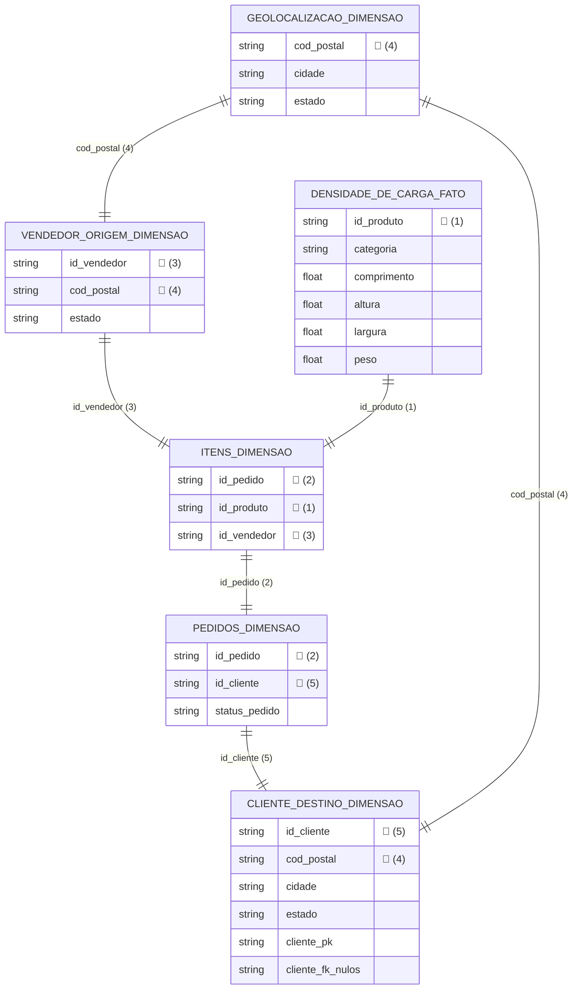

# 🚚 Análise Logística do E-Commerce 


## 📝 Visão Geral 

Este projeto consiste no desenvolvimento de uma Infraestrutura de Dados para analisar a Eficiência da Rede Logística e o desempenho das entregas no e-commerce brasileiro, servindo como o **Projeto de Conclusão (Capstone Project) do Certificado Profissional de Análise de Dados do Google**. A análise foi estruturada seguindo rigorosamente as fases de governança, processamento e geração de insights recomendadas pelo framework do Google.


<!-- Selos do Certificado Google e Coursera -->
 &nbsp;&nbsp; 


## Tecnologias Utilizadas


<table>
  <tr>
    <td align="center" width="90"></td>
    <td align="center" width="90"></td>
    <td align="center" width="90"></td>
    <td align="center" width="90"></td>
    <td align="center" width="90"></td>
    <td align="center" width="90"></td>
    <td align="center" width="90"></td>
  </tr>
</table>


## Estrutura Formal do Projeto

```text
├── LICENÇA
├── README.md                                 <- Guia e documentação executiva do portfólio.
├── consultas/                                <- Diretório dos scripts SQL executados no BigQuery.
│   ├── 01-preparacao-e-homologacao.sql       <- Validação de integridade, governança e viabilidade dos dados.
│   ├── 02-pipeline-engenharia-limpeza.sql    <- Processamento das CTEs e consolidação das 102.425 linhas.
│   └── 03-analise-estatistica-descritiva.sql <- Queries analíticas de cubagem, peso e volumetria de rotas.
├── relatórios/                               <- Entregáveis de visualização e tomada de decisão.
│   ├── dashboard-malha-logistica.pbix        <- Painel dinâmico e interativo desenvolvido no Power BI.
│   └── relatorio-insights-executivos.pdf     <- Relatório executivo formal com conclusões e planos de ação.
└── fonte/dados brutos                        <- Fontes originais do projeto. Arquivos (.csv), Olist.
    
```


## 🎯 Objetivo Geral

Diferentemente da maioria das análises públicas de e-commerce, que focam estritamente no tempo de entrega (lead time), este projeto adota uma abordagem de Engenharia de Redes Logísticas. O objetivo principal é analisar a capilaridade das rotas comerciais brasileiras sob a ótica da ocupação física de frota, avaliando o comportamento da densidade de carga (peso e cubagem) despachada entre os polos de origem e de destino. A análise estatística visa a identificar gargalos operacionais e assimetrias regionais no escoamento de mercadorias no e-commerce.

## 📌 Objetivos Específicos

O projeto gira em torno dos seguintes objetivos específicos:

**1. Verificação da assimetria geográfica no despacho de mercadorias:** identificar quais estados despacham cargas estatisticamente mais volumosas ou pesadas. Isso demonstrará quais regiões são polos de cargas robustas e quais enviam pacotes pequenos, auxiliando no dimensionamento da frota necessária para o atendimento desses locais.

**2. Construção da Matriz de Densidade de Carga:** mapear para quais estados de destino estão indo as mercadorias mais volumosas, leves ou pesadas, justificando o tipo de veículo necessário (pequeno ou grande porte) e a viabilidade de modais de transporte alternativos.

**3. Mapeamento do fluxo de escoamento:** quantificar o percentual dos pedidos que saem das regiões Sul e Sudeste e cruzam o país para abastecer o Norte e Nordeste. Essa métrica serve para justificar estrategicamente a necessidade de criação de novos Centros de Distribuição (CDs) para descentralizar os estoques.

**4. Demonstração do peso por Rota Comercial:** analisar estatisticamente se estados mais distantes (Norte/Nordeste) consomem produtos significativamente mais leves (como eletrônicos e cosméticos) para mitigar o impacto dos custos logísticos de longa distância, enquanto o Sul/Sudeste absorve produtos mais pesados (como móveis e eletrodomésticos).

## 🛠 Definição de Escopo e Arquitetura de Dados

Para garantir a eficiência computacional e o alinhamento com o objetivo de Engenharia de Redes Logísticas (focado em peso, cubagem e rotas), foi realizado um processo rigoroso de Recorte de Escopo no ecossistema original da Olist:


**Foco em Volumetria e Fluxo:** O projeto consolidou uma matriz relacional baseada estritamente nas entidades essenciais de tráfego físico, que basicamente se resumem a origem e destino da carga, peso ou volume, categoria de produtos transportados e geolocalização. 

**Abstração de Entidades Operacionais:** Visando manter a consistência analítica voltada à capacidade de carga, tabelas puramente transacionais como tempo de entrega, valor de frete e afins foram deliberadamente desconsideradas do pipeline principal, reduzindo o ruído estatístico na análise e garantindo que somente os dados de interesse fossem considerados. Essa atitude promove economia de recursos e redução do esforço computacional no processamento dos dados.


## 📊 Dataset Escolhido

O conjunto de dados utilizado foi obtido através da plataforma Kaggle e se refere a um conjunto de dados bastante conhecido por retratar dados reais e anonimizados do e-commerce no Brasil: o Olist.


## 📐 Arquitetura da Base de Dados

Antes do processo de consolidação, o ecossistema de dados foi desenhado com base em 6 entidades estruturais (tabelas), mapeadas a partir dos arquivos brutos (.csv):

<details>
<summary>📂 Clique para acessar os Dados Brutos Originais (Kaggle)</summary>

Os arquivos originais utilizados neste projeto pertencem ao ecossistema de e-commerce da Olist e podem ser baixados individualmente nos links abaixo:

* 📄 **Produtos (Densidade de Carga):** [olist_products_dataset.csv](./dados_brutos/olist_products_dataset.csv)
* 📄 **Itens dos Pedidos:** [olist_order_items_dataset.csv](./dados_brutos/olist_order_items_dataset.csv)
* 📄 **Clientes:** [olist_customers_dataset.csv](./dados_brutos/olist_customers_dataset.csv)
* 📄 **Geolocalização:** [olist_geolocation_dataset.csv](./dados_brutos/olist_geolocation_dataset.csv)
* 📄 **Pedidos:** [olist_orders_dataset.csv](./dados_brutos/olist_orders_dataset.csv)
* 📄 **Vendedores:** [olist_sellers_dataset.csv](./dados_brutos/olist_sellers_dataset.csv)

*(Nota: Caso prefira baixar o pacote completo consolidado, você pode acessar diretamente a página principal do dataset no **[Kaggle](https://kaggle.com)**).*

</details>


## 💻 Pipeline de Engenharia e Tratamento de Dados

O processo de transformação de dados foi executado via Google BigQuery utilizando SQL (GoogleSQL) estruturado em CTEs (*Common Table Expressions*). 

A arquitetura do pipeline foi desenhada criando **CTEs de limpeza exclusivas** (uma para cada tabela de origem). Esse método permitiu centralizar as regras de limpeza, tratamento de expressões regulares, imputação e formatação de maneira isolada por entidade. A consolidação final foi realizada utilizando cruzamentos relacionais do tipo **`LEFT JOIN`**, garantindo a integridade da base principal e evitando a perda acidental de registros devido a potenciais inconsistências ou dados ausentes nas tabelas acessórias.


## 📊 Metodologia de Análise

Para mapear a volumetria das rotas comerciais e identificar as assimetrias regionais, o projeto utilizou as seguintes métricas descritivas fundamentais: Análise Exploratória de Dados e Estatística Descritiva.

## 💾 Estrutura do Dataset Consolidado

Após a execução do pipeline de ETL, a tabela final limpa foi consolidada no Google BigQuery com 102.425 linhas.


## ⚙️ Fases da Análise de Dados

</p>
<!-- FASE 1: PREPARAR -->
<details>
<summary><h2>📁 Fase 1: Preparar (Modelagem e Viabilidade)</h2></summary>
<p>

Aqui ocorre a validação dos dados brutos para saber se são datasets reais ou artificiais.


## 🛑 1.1 Homologação de Autenticidade e Filtro de Viabilidade

Antes de iniciar qualquer esforço computacional de engenharia ou pipeline de ETL, foi estabelecida uma **"Etapa Zero" de Governança**. O objetivo foi mitigar o risco de processar dados sintéticos ou simulados (comportamento comum em bases públicas), garantindo que apenas entidades com variabilidade empírica real fossem integradas ao projeto.

Para isso, todas as tabelas originais que lidam com dados numéricos (do tipo INTEGER ou FLOAT) foram submetidas a um teste preliminar de **Estatística Descritiva Agrupada**, avaliando o comportamento das médias, desvios padrões e amplitudes (Mín/Máx). Tabelas que não lidam com dados tipo INTEGER ou FLOAT, não precisam sem submetidas ao teste para validar a heterocedasticidade.

**Critério de Aceitação:** As entidades que apresentaram comportamento **Heterocedástico** (variabilidade real, dispersão orgânica e desvios padrões consistentes) foram homologadas para o pipeline.

**Critério de Exclusão:** Tabelas que demonstraram variabilidade nula ou repetição matemática perfeita foram deliberadamente desconsideradas desta fase do projeto, otimizando o esforço de engenharia e blindando os futuros insights contra dados sem valor analítico.

> [IMPORTANTE]
> 💡 **Nota de Experiência Pessoal:** Esse é um procedimento padrão que tenho adotado antes de iniciar a manipulação de qualquer volume de dados, pois garante que eu esteja trabalhando com um conjunto de dados real, e não com um dataset manipulado por I.A. e que não apresenta variabilidade. Essa abordagem nasceu da necessidade prática após experiências anteriores com bases públicas sintéticas que inviabilizaram a geração de insights.


</p>

## 1.2 Teste de Heterocedasticidade

Clique abaixo para visualizar as queries de validação de variância da base original:

<details style="margin-left: 20px; margin-bottom: 10px;">
<summary><b>📦 Tabela: Produtos (olist_products)</b></summary>


A tabela referente ao arquivo "olist_products" (aqui no projeto denominada como "densidade_carga") é a única que lida de maneira majoritária com dados do tipo INTEGER/FLOAT, estando, portanto, apta a submeter-se ao teste que valida sua heterocedasticidade.


    
```sql

SELECT product_category_name,

  AVG (product_weight_g) AS media_peso,
  AVG (product_length_cm) AS media_comprimento, 
  AVG (product_height_cm) AS media_altura,
  AVG (product_width_cm) AS media_largura,

  STDDEV(product_weight_g) AS desvio_peso,
  STDDEV(product_length_cm) AS desvio_comprimento,
  STDDEV(product_height_cm) AS desvio_altura,
  STDDEV(product_width_cm) AS desvio_largura,

  MIN (product_weight_g) AS min_peso,
  MIN (product_length_cm) AS min_comp,
  MIN (product_height_cm) AS min_altura, 
  MIN (product_width_cm) AS min_largura,

  MAX (product_weight_g) AS max_peso,
  MAX (product_length_cm) AS max_comp,
  MAX (product_height_cm) AS max_altura, 
  MAX (product_width_cm) AS max_largura

 FROM `skilled-sunrise-486800-j9.analise_logistica.densidade_carga` 

GROUP BY product_category_name
ORDER BY media_peso DESC
 LIMIT 100;

```
Conclusão: A aplicação da estatística descritiva agrupada por categoria provou empiricamente que o dataset possui natureza REAL. A dispersão observada através dos desvios padrões e a amplitude entre os valores mínimos e máximos refletem o comportamento esperado de uma operação logística real.<br><br>
O conjunto de dados apresenta um comportamento HETEROCEDÁSTICO (variâncias significativamente diferentes entre as categorias de produtos), o que é característico do e-commerce brasileiro.<br><br>
Fica validada a riqueza estatística da base para darmos início ao processo de engenharia e limpeza de dados.


  </details>
  </details>

</details>

 
<!-- FASE 2: PROCESSAR -->
<details>
<summary><h2>🧹 Fase 2: Processar (Engenharia de Dados e Limpeza)</h2></summary>
<p>
Aqui ocorre a transformação pesada dos dados brutos no Google BigQuery utilizando 6 CTEs modulares, uma para cada tabela utilizada.

### 📑 Scripts SQL de Limpeza 
Os scripts com as transformações de cada base de dados podem ser consultados individualmente nos links abaixo:

| Pipeline de Limpeza (Tabela) | Link para o Script SQL |
| :--- | :--- |
| 📦 **Densidade de Carga** | [Visualizar SQL](./consultas/Código%20Tabela%20Densidade%20de%20Carga%20Limpo%20.sql) |
| 🛒 **Itens dos Pedidos** | [Visualizar SQL](./consultas/Código%20Tabela%20Itens%20Limpa.sql) |
| 👥 **Clientes** | [Visualizar SQL](consultas/Código%20Tabela%20Cliente%20Destino%20Limpa.sql) |
| 📍 **Geolocalização** | [Visualizar SQL](./consultas/Código%20Tabela%20Geolocalização%20Limpa.sql) |
| 📝 **Pedidos** | [Visualizar SQL](./consultas/Código%20Tabela%20Pedidos%20Limpo.sql) |
| 🏬 **Vendedores** | [Visualizar SQL](./consultas/Código%20Tabela%20Vendedor%20Origem%20Limpo.sql) |


Após efetuada a limpeza de todas as tabelas, o desafio foi uni-las usando cláusulas LEFT JOIN para fazer a integração das chaves primárias com as chaves estrangeiras. Foi esboçado também uma DIAGRAMA ENTIDADE-RELACIONAMENTO para ajudar a entender de que forma as tabelas se relacionam entre si e qual delas era a Tabela Fato e quais eram as Tabelas Dimensão.

| Pipeline de Integração e Modelagem (Tabela) | Link para o Script SQL |
| :--- | :--- |
| 🗄️ **Base Analítica Consolidada** | [Visualizar SQL](./consultas/Join%20para%20Análise%20Estatística%20-%20Dataset%20Logística.sql) |

A união dessas tabelas por meio de uma estrutura de CTE com qualificação de escopo permitiram concluir a fase de **Processar** da metodologia Google. O resultado foi a materialização de uma tabela física permanente (`base_analitica`), garantindo a integridade dos registros e otimizando severamente o custo e a performance de processamento para os próximos passos.

<details>
<summary>💡 Clique aqui para entender os desafios técnicos e soluções na consolidação dos JOINs</summary>


A query acima foi construída com uma engenharia e arquitetura diferentes. Tive muita dificuldade para conectar essas tabelas, pois toda vez que tentava executar um LEFT JOIN, o código quebrava. Aparentemente havia algum conflito entre o nome das tabelas e o comando SELECT. O SELECT serve para exibir COLUNAS de uma determinada tabela, portanto, mesmo colocando o asterisco isolado  após o comando, o código não rodava. Tentei de todas as formas possíveis fazer com que as tabelas e suas respectivas colunas fossem lidas e processadas pelo BigQuery, porém o sistema exibia um erro de sintaxe. Eu descobri, mediante pesquisa, que havia uma maneira de representar todas as colunas de todas as tabelas de uma única vez, entretanto sem utilizar o comando padrão SELECT + asterisco. 

Para resolver este impasse, usei aliases monossilábicos para representar as tabelas. Depois que o BigQuery fez a leitura dos aliases e os registrou na memória, eu os coloquei após o comando SELECT acompanhados de um ponto e um asterisco. Esse mecanismo é chamado de QUALIFICAÇÃO DE ESCOPO. A combinação do alias + ponto + asterisco funciona como um atalho. Quando o BigQuery lê dc.* ou ids.*, o mecanismo por trás faz o seguinte: lê as tabelas e depois lê todas as colunas de cada uma das tabelas e as replica no comando SELECT. Em outras palavras, ele "desembrulha" a tabela e substitui aquele asterisco pela lista escrita de TODAS as colunas, separadas por vírgula. Foi assim que consegui resolver o problema e fazer com que todas as colunas de todas as tabelas citadas fossem lidas pelo SELECT.

Se eu não tivesse descoberto esse atalho e as tabelas limpas tivessem 20 colunas cada uma, por exemplo, eu seria obrigado a digitar manualmente, para cada uma das tabelas, os 20 nomes de colunas no topo do código. Ao usar dc.* ou ids.*, eu mantenho a regra do SELECT (trazer colunas), mas uso o poder do banco de dados para listar todas elas de maneira mais prática, sem a necessidade de especificá-las uma a uma. 

Depois que solucionei o problema anterior, deparei-me com outro: a dificuldade de conectar as chaves primárias (PK) com as chaves estrangeiras (FK), bem como definir quem era TABELA DIMENSÃO e quem era TABELA FATO. Montei de maneira informal e improvisada um rascunho para o DIAGRAMA ENTIDADE-RELACIONAMENTO na tentativa de conseguir determinar de que forma uma tabela se comunicava com a outra. Desenhei retângulos para representar as tabelas; dentro dos retângulos listei somente as colunas que eu iria usar na minha análise e desprezei as colunas que considerei desnecessárias. 

A tabela de DENSIDADE DE CARGA foi a que melhor se encaixou no conceito da tabela fato, pois ela representa, indubitavelmente, o coração da minha análise. É justamente dessa tabela que vem as informações sobre os pesos e volumes das cargas (bjetos de análise do meu projeto) e sobre as quais eu não poderia perder uma única linha. Deste modo, ela foi escolhida como HUB e posicionei ela à esquerda do comando LEFT JOIN. Isso garante que o sistema faça a leitura considerando todas as suas linhas, gerando conexões perfeitas (quando suas chaves estrangeiras se correspondem com as chaves primárias de outra tabela dimensão) ou gerando linhas com valores nulos quando não há correspondênca entre as chaves. 

Outra candidata à Tabela Fato seria a tabela ÍTENS, pois ela marcava dados financeiros tais como preço dos produtos e preço do frete. Entretanto, minha análise não foca no clichê de análise de custo de frete. O preço do produto também é irrelevante na análise, visto que no modelo logístico tradicional de e-commerce, o preço do produto não dita a inteligência de malha de distribuição. Uma geladeira de R$ 3.000 e uma televisão de R$ 3.000 ocupam espaços totalmente diferentes e exigem frotas/veículos de entrega completamente distintos. Deste modo, optei por desconsiderar essas duas colunas reduzindo os dados a uma tabela formada essencialmente por IDs (ID do pedido, ID do produto e ID do vendedor). Nesse caso, a tabela de itens acabou se tornando uma mera Tabela Dimensão que comporta chaves primárias relevantes para fazer conexões. 

A modelagem de dados pedominante nesses JOINS é o Modelo Floco de Neve (Snowflake Schema). Existe uma tabela fato que se liga à tabela dimensão, mas também observamos tabelas dimensões se ligando a outras tabelas dimensão. A geolocalização se ligando ao cliente é um exemplo. Quando uma dimensão se conecta em outra dimensão antes de chegar na fato, as pontas da sua "estrela" se ramificam. É por isso que esse modelo se chama Floco de Neve.

</details>

<details>
<summary>📂 Visualizar Diagrama Entidade-Relacionamento </summary>




</details>

</details>

<!-- FASE 3: ANALISAR -->
<details>
<summary><h2>📊 Fase 3: Analisar (Estatística Descritiva)</h2></summary>
<p>


*(Esta seção será preenchida na próxima fase do projeto)*

</details>

<!-- FASE 4 E 5: COMPARTILHAR E AGIR (Agora totalmente visível) -->
<details>
<summary><h2>🚀 Fases 4 e 5: Compartilhar e Agir (Visualização de Dados e Insights)</h2></summary>
<p>


*(Esta seção será preenchida após a conclusão das análises)*

</details>


   © 2026 José Diego Andrade Santos. Alguns direitos reservados.
   Este projeto está livremente disponível para fins de estudo, consulta e aprendizado.


